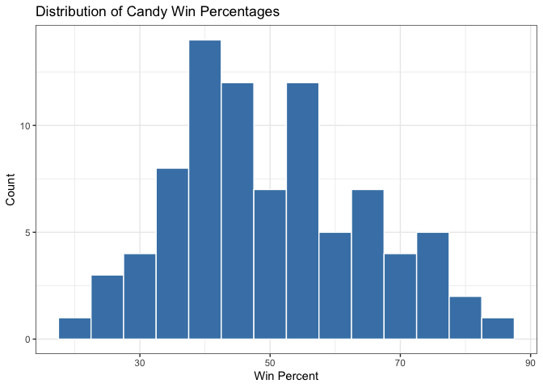
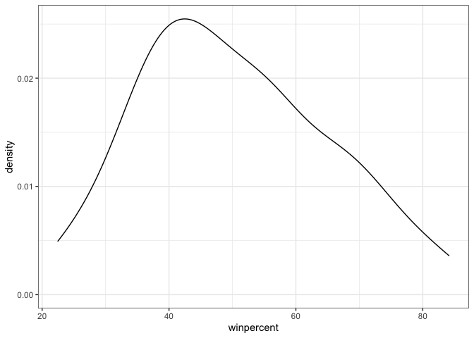
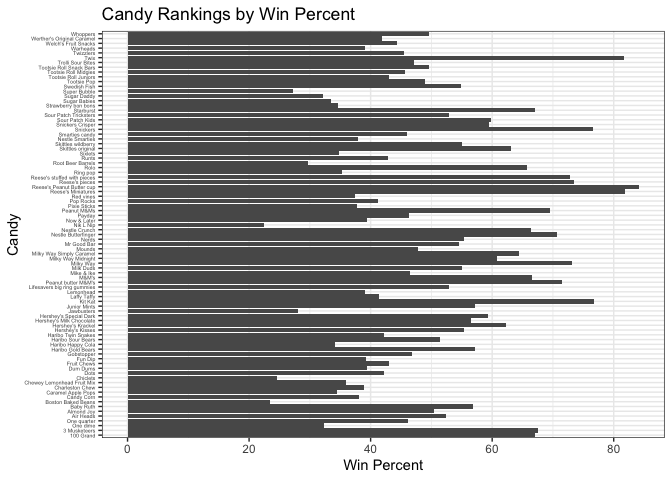
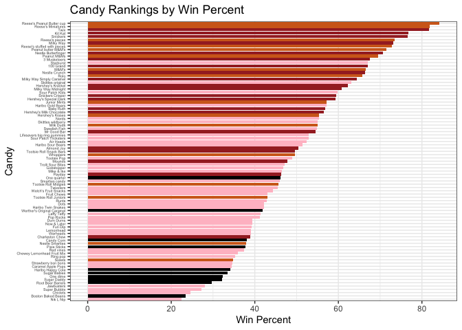
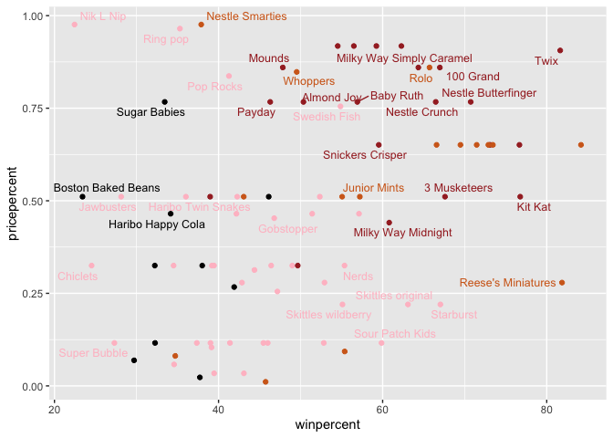
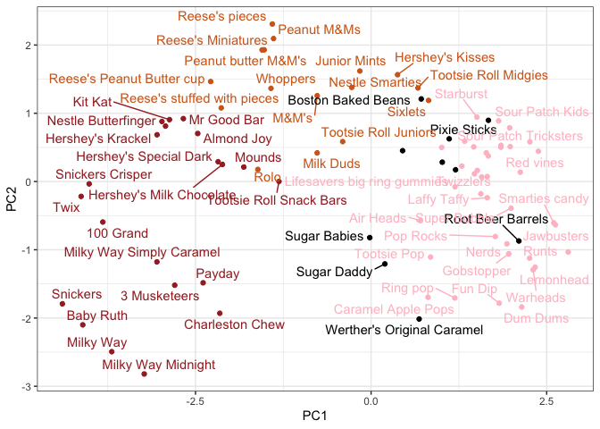

# Class 10: Halloween mini project
Joseph Girgiss (PID: A17388247)

- [Data Import](#data-import)
- [Quick overview of the dataset](#quick-overview-of-the-dataset)
- [Winpercent and Pricepercent](#winpercent-and-pricepercent)
- [Exploring the correlation
  structure](#exploring-the-correlation-structure)
- [Principal component analysis](#principal-component-analysis)

As it is nearly Halloween and the half way point in the quarter let’s do
a mini project to help us figure out the best candy!

Our data comes from the 538 website and is available as a CSV file:

## Data Import

``` r
candy_file <- "candy-data.csv"
candy = read.csv(candy_file, row.names=1)
head(candy)
```

                 chocolate fruity caramel peanutyalmondy nougat crispedricewafer
    100 Grand            1      0       1              0      0                1
    3 Musketeers         1      0       0              0      1                0
    One dime             0      0       0              0      0                0
    One quarter          0      0       0              0      0                0
    Air Heads            0      1       0              0      0                0
    Almond Joy           1      0       0              1      0                0
                 hard bar pluribus sugarpercent pricepercent winpercent
    100 Grand       0   1        0        0.732        0.860   66.97173
    3 Musketeers    0   1        0        0.604        0.511   67.60294
    One dime        0   0        0        0.011        0.116   32.26109
    One quarter     0   0        0        0.011        0.511   46.11650
    Air Heads       0   0        0        0.906        0.511   52.34146
    Almond Joy      0   1        0        0.465        0.767   50.34755

> Q1. How many different candy types are in this dataset?

``` r
nrow(candy)
```

    [1] 85

> Q2. How many fruity candy types are in the dataset?

``` r
sum(candy$fruity)
```

    [1] 38

``` r
candy["Twix", ]$winpercent
```

    [1] 81.64291

> Q3. What is your favorite candy in the dataset and what is it’s
> winpercent value?

My favorite candy in the dataset is Milky Way.

``` r
candy["Milky Way", ]$winpercent
```

    [1] 73.09956

> Q4. What is the winpercent value for “Kit Kat”?

``` r
candy["Kit Kat", ]$winpercent
```

    [1] 76.7686

> Q5. What is the winpercent value for “Tootsie Roll Snack Bars”?

``` r
candy["Tootsie Roll Snack Bars", ]$winpercent
```

    [1] 49.6535

## Quick overview of the dataset

``` r
library(skimr)
skimr::skim(candy)
```

|                                                  |       |
|:-------------------------------------------------|:------|
| Name                                             | candy |
| Number of rows                                   | 85    |
| Number of columns                                | 12    |
| \_\_\_\_\_\_\_\_\_\_\_\_\_\_\_\_\_\_\_\_\_\_\_   |       |
| Column type frequency:                           |       |
| numeric                                          | 12    |
| \_\_\_\_\_\_\_\_\_\_\_\_\_\_\_\_\_\_\_\_\_\_\_\_ |       |
| Group variables                                  | None  |

Data summary

**Variable type: numeric**

| skim_variable | n_missing | complete_rate | mean | sd | p0 | p25 | p50 | p75 | p100 | hist |
|:---|---:|---:|---:|---:|---:|---:|---:|---:|---:|:---|
| chocolate | 0 | 1 | 0.44 | 0.50 | 0.00 | 0.00 | 0.00 | 1.00 | 1.00 | ▇▁▁▁▆ |
| fruity | 0 | 1 | 0.45 | 0.50 | 0.00 | 0.00 | 0.00 | 1.00 | 1.00 | ▇▁▁▁▆ |
| caramel | 0 | 1 | 0.16 | 0.37 | 0.00 | 0.00 | 0.00 | 0.00 | 1.00 | ▇▁▁▁▂ |
| peanutyalmondy | 0 | 1 | 0.16 | 0.37 | 0.00 | 0.00 | 0.00 | 0.00 | 1.00 | ▇▁▁▁▂ |
| nougat | 0 | 1 | 0.08 | 0.28 | 0.00 | 0.00 | 0.00 | 0.00 | 1.00 | ▇▁▁▁▁ |
| crispedricewafer | 0 | 1 | 0.08 | 0.28 | 0.00 | 0.00 | 0.00 | 0.00 | 1.00 | ▇▁▁▁▁ |
| hard | 0 | 1 | 0.18 | 0.38 | 0.00 | 0.00 | 0.00 | 0.00 | 1.00 | ▇▁▁▁▂ |
| bar | 0 | 1 | 0.25 | 0.43 | 0.00 | 0.00 | 0.00 | 0.00 | 1.00 | ▇▁▁▁▂ |
| pluribus | 0 | 1 | 0.52 | 0.50 | 0.00 | 0.00 | 1.00 | 1.00 | 1.00 | ▇▁▁▁▇ |
| sugarpercent | 0 | 1 | 0.48 | 0.28 | 0.01 | 0.22 | 0.47 | 0.73 | 0.99 | ▇▇▇▇▆ |
| pricepercent | 0 | 1 | 0.47 | 0.29 | 0.01 | 0.26 | 0.47 | 0.65 | 0.98 | ▇▇▇▇▆ |
| winpercent | 0 | 1 | 50.32 | 14.71 | 22.45 | 39.14 | 47.83 | 59.86 | 84.18 | ▃▇▆▅▂ |

> Q6. Is there any variable/column that looks to be on a different scale
> to the majority of the other columns in the dataset?

Yes, winpercent looks to be on a different scale since its values
between 0-100 when all others are between 0 and 1.

> Q7. What do you think a zero and one represent for the
> candy\$chocolate column?

``` r
candy$chocolate
```

     [1] 1 1 0 0 0 1 1 0 0 0 1 0 0 0 0 0 0 0 0 0 0 0 1 1 1 1 0 1 1 0 0 0 1 1 0 1 1 1
    [39] 1 1 1 0 1 1 0 0 0 1 0 0 0 1 1 1 1 0 1 0 0 1 0 0 1 0 1 1 0 0 0 0 0 0 0 0 1 1
    [77] 1 1 0 1 0 0 0 0 1

1 = the candy is a chocolate, 0 = the candy is not a chocolate.

> Q8. Plot a histogram of winpercent values

``` r
library(ggplot2)

ggplot(candy, aes(winpercent)) +
  geom_histogram(binwidth = 5, fill = "steelblue", color = "white") +
  labs(title = "Distribution of Candy Win Percentages",
       x = "Win Percent", y = "Count") + 
  theme_bw()
```



> Q9. Is the distribution of winpercent values symmetrical?

``` r
ggplot(candy, aes(winpercent)) +
  geom_density() + 
  theme_bw()
```



The distribution of winpercent values is asymmetrical.

> Q10. Is the center of the distribution above or below 50%?

``` r
mean(candy$winpercent)
```

    [1] 50.31676

``` r
summary(candy$winpercent)
```

       Min. 1st Qu.  Median    Mean 3rd Qu.    Max. 
      22.45   39.14   47.83   50.32   59.86   84.18 

Center: mean = 50.31676 \> 50%, median = 47.83 \< 50% (indicating a
right skew).

> Q11. On average is chocolate candy higher or lower ranked than fruit
> candy?

``` r
# 1. Find all chocolate candy in the dataset 
# 2. Find their winpercent values 
# 3. Calculate the mean of these values 
# 4. Repeat for fruity candy. 
# 5. Compare mean winpercents of chocolate vs fruity

choc.inds <- candy$chocolate==1
choc.win <- candy[choc.inds, ]$winpercent
choc.mean <- mean(choc.win)
choc.mean
```

    [1] 60.92153

``` r
fruit.inds <- candy$fruity==1
fruit.win <- candy[fruit.inds, ]$winpercent
fruit.mean <- mean(fruit.win)
fruit.mean
```

    [1] 44.11974

``` r
library(dplyr)
```


    Attaching package: 'dplyr'

    The following objects are masked from 'package:stats':

        filter, lag

    The following objects are masked from 'package:base':

        intersect, setdiff, setequal, union

``` r
candy %>%
  summarize(
    mean_choc = mean(winpercent[chocolate == 1]),
    mean_fruit = mean(winpercent[fruity == 1])
  )
```

      mean_choc mean_fruit
    1  60.92153   44.11974

On average the chocolate candy is higher than fruity candy.

> Q12. Is this difference statistically significant?

``` r
t.test(choc.win, fruit.win)
```


        Welch Two Sample t-test

    data:  choc.win and fruit.win
    t = 6.2582, df = 68.882, p-value = 2.871e-08
    alternative hypothesis: true difference in means is not equal to 0
    95 percent confidence interval:
     11.44563 22.15795
    sample estimates:
    mean of x mean of y 
     60.92153  44.11974 

The difference between chocolate and fruity candy is statistically
significant because the p-value is very small (p-value = 2.871e-08).

> Q13. What are the five least liked candy types in this set?

``` r
candy %>% 
  arrange(winpercent) %>%
  head(5)
```

                       chocolate fruity caramel peanutyalmondy nougat
    Nik L Nip                  0      1       0              0      0
    Boston Baked Beans         0      0       0              1      0
    Chiclets                   0      1       0              0      0
    Super Bubble               0      1       0              0      0
    Jawbusters                 0      1       0              0      0
                       crispedricewafer hard bar pluribus sugarpercent pricepercent
    Nik L Nip                         0    0   0        1        0.197        0.976
    Boston Baked Beans                0    0   0        1        0.313        0.511
    Chiclets                          0    0   0        1        0.046        0.325
    Super Bubble                      0    0   0        0        0.162        0.116
    Jawbusters                        0    1   0        1        0.093        0.511
                       winpercent
    Nik L Nip            22.44534
    Boston Baked Beans   23.41782
    Chiclets             24.52499
    Super Bubble         27.30386
    Jawbusters           28.12744

> Q14. What are the top 5 all time favorite candy types out of this set?

``` r
candy %>% 
  arrange(desc(winpercent)) %>%
  head(5)
```

                              chocolate fruity caramel peanutyalmondy nougat
    Reese's Peanut Butter cup         1      0       0              1      0
    Reese's Miniatures                1      0       0              1      0
    Twix                              1      0       1              0      0
    Kit Kat                           1      0       0              0      0
    Snickers                          1      0       1              1      1
                              crispedricewafer hard bar pluribus sugarpercent
    Reese's Peanut Butter cup                0    0   0        0        0.720
    Reese's Miniatures                       0    0   0        0        0.034
    Twix                                     1    0   1        0        0.546
    Kit Kat                                  1    0   1        0        0.313
    Snickers                                 0    0   1        0        0.546
                              pricepercent winpercent
    Reese's Peanut Butter cup        0.651   84.18029
    Reese's Miniatures               0.279   81.86626
    Twix                             0.906   81.64291
    Kit Kat                          0.511   76.76860
    Snickers                         0.651   76.67378

> Q15. Make a first barplot of candy ranking based on winpercent values.

``` r
library(ggplot2)
candy$CandyName <- factor(rownames(candy), levels = rownames(candy))


ggplot(candy) +
  aes(x = winpercent, y = CandyName) +
  geom_col() +   
  theme_bw() +
  labs(x = "Win Percent", y = "Candy", title = "Candy Rankings by Win Percent") +
  theme(
    axis.text.y = element_text(size = 4)   
  )
```



> Q16. This is quite ugly, use the reorder() function to get the bars
> sorted by winpercent?

Let’s also add some color based on the type of candy.

``` r
my_cols=rep("black", nrow(candy))
my_cols[as.logical(candy$chocolate)] = "chocolate"
my_cols[as.logical(candy$bar)] = "brown"
my_cols[as.logical(candy$fruity)] = "pink"
```

``` r
candy$CandyName <- factor(rownames(candy), levels = rownames(candy)[order(candy$winpercent)])
ggplot(candy) +
  aes(x = winpercent, y = CandyName) +
  geom_col(fill=my_cols) +   
  theme_bw() +
  labs(x = "Win Percent", y = "Candy", title = "Candy Rankings by Win Percent") +
  theme(
    axis.text.y = element_text(size = 4)   
  )
```



> Q17. What is the worst ranked chocolate candy?

``` r
candy %>% 
  filter(chocolate == 1) %>%
  arrange(winpercent) %>%
  head(1)
```

            chocolate fruity caramel peanutyalmondy nougat crispedricewafer hard
    Sixlets         1      0       0              0      0                0    0
            bar pluribus sugarpercent pricepercent winpercent CandyName
    Sixlets   0        1         0.22        0.081     34.722   Sixlets

Sixlets are the worst ranked chocolate candy.

> Q18. What is the best ranked fruity candy?

``` r
candy %>% 
  filter(fruity == 1) %>%
  arrange(desc(winpercent)) %>%
  head(1)
```

              chocolate fruity caramel peanutyalmondy nougat crispedricewafer hard
    Starburst         0      1       0              0      0                0    0
              bar pluribus sugarpercent pricepercent winpercent CandyName
    Starburst   0        1        0.151         0.22   67.03763 Starburst

Starburst is the best ranked fruity candy.

## Winpercent and Pricepercent

A plot with both variable/columns winpercent and pricepercent

``` r
library(ggrepel)

# How about a plot of price vs win
ggplot(candy) +
  aes(winpercent, pricepercent, label=rownames(candy)) +
  geom_point(col=my_cols) + 
  geom_text_repel(col=my_cols, size=3.3, max.overlaps = 5)
```

    Warning: ggrepel: 50 unlabeled data points (too many overlaps). Consider
    increasing max.overlaps



> Q19. Which candy type is the highest ranked in terms of winpercent for
> the least money - i.e. offers the most bang for your buck?

``` r
library(dplyr)
candy %>%
  mutate(Value = winpercent / (pricepercent + 1e-6)) %>%
  arrange(desc(Value)) %>%
  head(1)
```

                         chocolate fruity caramel peanutyalmondy nougat
    Tootsie Roll Midgies         1      0       0              0      0
                         crispedricewafer hard bar pluribus sugarpercent
    Tootsie Roll Midgies                0    0   0        1        0.174
                         pricepercent winpercent            CandyName    Value
    Tootsie Roll Midgies        0.011   45.73675 Tootsie Roll Midgies 4157.508

> Q20. What are the top 5 most expensive candy types in the dataset and
> of these which is the least popular?

``` r
top5_expensive <- candy %>%
  arrange(desc(pricepercent)) %>%   # sort by price descending
  slice(1:5) %>%                    # take top 5
  select(pricepercent, winpercent)  # show relevant columns

top5_expensive
```

                             pricepercent winpercent
    Nik L Nip                       0.976   22.44534
    Nestle Smarties                 0.976   37.88719
    Ring pop                        0.965   35.29076
    Hershey's Krackel               0.918   62.28448
    Hershey's Milk Chocolate        0.918   56.49050

``` r
least_popular <- top5_expensive %>%
  slice_min(winpercent)   # candy with lowest winpercent

least_popular
```

              pricepercent winpercent
    Nik L Nip        0.976   22.44534

## Exploring the correlation structure

Now that we’ve explored the dataset a little, we’ll see how the
variables interact with one another. We’ll use correlation and view the
results with the corrplot package to plot a correlation matrix.

``` r
library(corrplot)
```

    corrplot 0.95 loaded

``` r
cij <- cor(candy[sapply(candy, is.numeric)])
corrplot(cij)
```


> Q22. Examining this plot what two variables are anti-correlated
> (i.e. have minus values)?

``` r
# Convert the correlation matrix to a data frame for easier filtering
corr_df <- as.data.frame(as.table(cij))
colnames(corr_df) <- c("Variable1", "Variable2", "Correlation")

# Filter out the diagonal (where Variable1 equals Variable2)
off_diagonal_corr <- subset(corr_df, Variable1 != Variable2)

# Find the row with the minimum correlation value
most_anti_correlated <- off_diagonal_corr[which.min(off_diagonal_corr$Correlation), ]

# Print the result
print("Most Anti-Correlated Pair:")
```

    [1] "Most Anti-Correlated Pair:"

``` r
print(most_anti_correlated)
```

      Variable1 Variable2 Correlation
    2    fruity chocolate  -0.7417211

Fruity and Chocolate are most anti-correlated.

> Q23. Similarly, what two variables are most positively correlated?

``` r
# Find the row with the maximum correlation value
most_positively_correlated <- off_diagonal_corr[which.max(off_diagonal_corr$Correlation), ]

# Print the result
print("Most Positively Correlated Pair:")
```

    [1] "Most Positively Correlated Pair:"

``` r
print(most_positively_correlated)
```

        Variable1 Variable2 Correlation
    12 winpercent chocolate   0.6365167

Winpercent and chocolate are the most potively correlated pair.

## Principal component analysis

The function to use is called `prcomp()` with an optional `scale=T/F`
argument.

``` r
candy_numeric <- candy[sapply(candy, is.numeric)]
pca <- prcomp(candy_numeric, scale=TRUE)
summary(pca)
```

    Importance of components:
                              PC1    PC2    PC3     PC4    PC5     PC6     PC7
    Standard deviation     2.0788 1.1378 1.1092 1.07533 0.9518 0.81923 0.81530
    Proportion of Variance 0.3601 0.1079 0.1025 0.09636 0.0755 0.05593 0.05539
    Cumulative Proportion  0.3601 0.4680 0.5705 0.66688 0.7424 0.79830 0.85369
                               PC8     PC9    PC10    PC11    PC12
    Standard deviation     0.74530 0.67824 0.62349 0.43974 0.39760
    Proportion of Variance 0.04629 0.03833 0.03239 0.01611 0.01317
    Cumulative Proportion  0.89998 0.93832 0.97071 0.98683 1.00000

Our main PCA result figure

``` r
ggplot(pca$x) + 
  aes(PC1, PC2) + 
  geom_point(col=my_cols) +
  geom_text_repel(col=my_cols,label=rownames(candy)) + 
  theme_bw()
```

    Warning: ggrepel: 21 unlabeled data points (too many overlaps). Consider
    increasing max.overlaps



We should also examine the variable “loadings” or contributions of the
original variable to the new PCs.

``` r
pca$rotation
```

                            PC1         PC2         PC3          PC4          PC5
    chocolate        -0.4019466  0.21404160  0.01601358 -0.016673032  0.066035846
    fruity            0.3683883 -0.18304666 -0.13765612 -0.004479829  0.143535325
    caramel          -0.2299709 -0.40349894 -0.13294166 -0.024889542 -0.507301501
    peanutyalmondy   -0.2407155  0.22446919  0.18272802  0.466784287  0.399930245
    nougat           -0.2268102 -0.47016599  0.33970244  0.299581403 -0.188852418
    crispedricewafer -0.2215182  0.09719527 -0.36485542 -0.605594730  0.034652316
    hard              0.2111587 -0.43262603 -0.20295368 -0.032249660  0.574557816
    bar              -0.3947433 -0.22255618  0.10696092 -0.186914549  0.077794806
    pluribus          0.2600041  0.36920922 -0.26813772  0.287246604 -0.392796479
    sugarpercent     -0.1083088 -0.23647379 -0.65509692  0.433896248  0.007469103
    pricepercent     -0.3207361  0.05883628 -0.33048843  0.063557149  0.043358887
    winpercent       -0.3298035  0.21115347 -0.13531766  0.117930997  0.168755073
                             PC6         PC7         PC8          PC9         PC10
    chocolate        -0.09018950 -0.08360642 -0.49084856 -0.151651568  0.107661356
    fruity           -0.04266105  0.46147889  0.39805802 -0.001248306  0.362062502
    caramel          -0.40346502 -0.44274741  0.26963447  0.019186442  0.229799010
    peanutyalmondy   -0.09416259 -0.25710489  0.45771445  0.381068550 -0.145912362
    nougat            0.09012643  0.36663902 -0.18793955  0.385278987  0.011323453
    crispedricewafer -0.09007640  0.13077042  0.13567736  0.511634999 -0.264810144
    hard             -0.12767365 -0.31933477 -0.38881683  0.258154433  0.220779142
    bar               0.25307332  0.24192992 -0.02982691  0.091872886 -0.003232321
    pluribus          0.03184932  0.04066352 -0.28652547  0.529954405  0.199303452
    sugarpercent      0.02737834  0.14721840 -0.04114076 -0.217685759 -0.488103337
    pricepercent      0.62908570 -0.14308215  0.16722078 -0.048991557  0.507716043
    winpercent       -0.56947283  0.40260385 -0.02936405 -0.124440117  0.358431235
                            PC11        PC12
    chocolate         0.10045278  0.69784924
    fruity            0.17494902  0.50624242
    caramel           0.13515820  0.07548984
    peanutyalmondy    0.11244275  0.12972756
    nougat           -0.38954473  0.09223698
    crispedricewafer -0.22615618  0.11727369
    hard              0.01342330 -0.10430092
    bar               0.74956878 -0.22010569
    pluribus          0.27971527 -0.06169246
    sugarpercent      0.05373286  0.04733985
    pricepercent     -0.26396582 -0.06698291
    winpercent       -0.11251626 -0.37693153

``` r
ggplot(pca$rotation) + 
  aes(PC1, rownames(pca$rotation)) +
  geom_col()
```


``` r
plot(pca$x[,1:2], col=my_cols, pch=16)
```


``` r
# Make a new data-frame with our PCA results and candy data
my_data <- cbind(candy, pca$x[,1:3])

p <- ggplot(my_data) + 
        aes(x=PC1, y=PC2, 
            size=winpercent/100,  
            text=rownames(my_data),
            label=rownames(my_data)) +
        geom_point(col=my_cols)

p
```


``` r
library(ggrepel)

p + geom_text_repel(size=3.3, col=my_cols, max.overlaps = 7)  + 
  theme(legend.position = "none") +
  labs(title="Halloween Candy PCA Space",
       subtitle="Colored by type: chocolate bar (dark brown), chocolate other (light brown), fruity (red), other (black)",
       caption="Data from 538")
```

    Warning: ggrepel: 39 unlabeled data points (too many overlaps). Consider
    increasing max.overlaps


Interactive plots that can be zoomed on and “brushed” over can be made
with the **plotly** package. It’s output is interactive and will not
render to PDF.

``` r
#library(plotly)
#ggplotly(p)
```

``` r
par(mar=c(8,4,2,2))
barplot(pca$rotation[,1], las=2, ylab="PC1 Contribution")
```


> Q24. What original variables are picked up strongly by PC1 in the
> positive direction? Do these make sense to you?

Fruity, hard, and pluribus are picked up strongly by PC1 in the positive
direction. This makes sense because PC1 can be considered as a
comparison of Chocolate vs fruity. It is logical that the features
defining a typical non-chocolate/hard/many-pieces candy (Fruity,
Pluribus, Hard) are strongly aligned in the positive direction of PC1,
contrasting with the chocolate/bar/high-value (high pricepercent and
winpercent) features in the negative direction.
