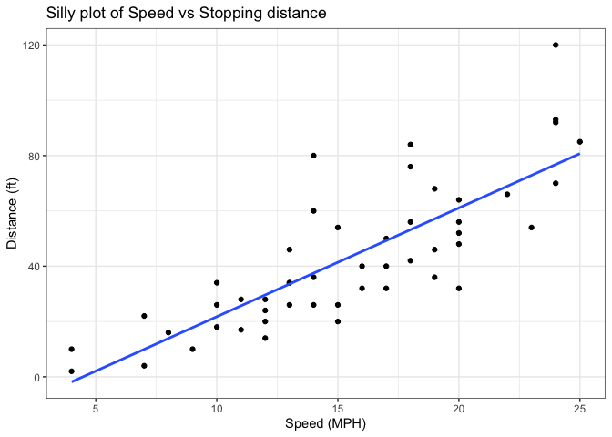
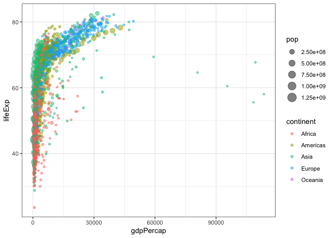
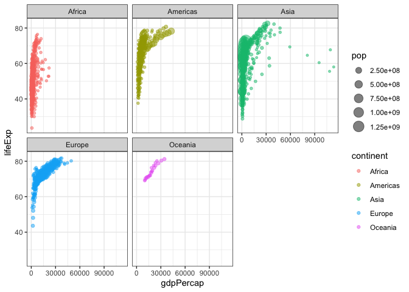

# Class 5: Data Visualization with ggplot
Joseph Girgiss (A17388247)

Today we are exploring the **ggplot** package and how to make nice
figures in R.

There are lots of ways to make figures and plots in R. These include:

- so called “base” R
- and add on packages like **ggplot2**

Here is a simple “base” R plot.

``` r
head(cars)
```

      speed dist
    1     4    2
    2     4   10
    3     7    4
    4     7   22
    5     8   16
    6     9   10

We can simply pass this to the `plot()` function.

``` r
plot(cars)
```


> Key-point: Base R is quick but not so nice looking in some folks eyes.

Let’s see how we can plot this with **ggplot2**…

First, I need to install this add-on package. For this we use the
`install.packages()` function - **WE DO THIS IN THE CONSOLE, NOT our
report**. This is a one time only deal.

Second, we need to load the package with `library()` function every time
we want to use it.

Every ggplot is composed of at least three layers:

- data (i.e. a data.frame with the things you want to plot)
- aesthetics **aes()** that map the columns of data to your plot
  features (i.e. aesthetics)
- geom like **geom_point()** that srt how the plot appears.

``` r
library(ggplot2)
ggplot(cars) + 
  aes(x=speed, y = dist) + 
  geom_point()
```


> Key point: For simple “canned” graphs, base R is quicker but as things
> get more elaborate then ggplot wins out…

Let’s add more layers to our ggplot.

Add a line showing the relationship between x and y. Add a title Add
custom axis labels “Speed (MPH)” and “Distance(ft)” Change the theme…

``` r
ggplot(cars) + 
  aes(x=speed, y = dist) + 
  geom_point() + 
  geom_smooth(method="lm", se=FALSE) + 
  labs(title = "Silly plot of Speed vs Stopping distance") + 
  xlab("Speed (MPH)") + 
  ylab("Distance (ft)") + 
  theme_bw()
```

    `geom_smooth()` using formula = 'y ~ x'



## Going further

Read some gene expression data

``` r
url <- "https://bioboot.github.io/bimm143_S20/class-material/up_down_expression.txt"
genes <- read.delim(url)
head(genes)
```

            Gene Condition1 Condition2      State
    1      A4GNT -3.6808610 -3.4401355 unchanging
    2       AAAS  4.5479580  4.3864126 unchanging
    3      AASDH  3.7190695  3.4787276 unchanging
    4       AATF  5.0784720  5.0151916 unchanging
    5       AATK  0.4711421  0.5598642 unchanging
    6 AB015752.4 -3.6808610 -3.5921390 unchanging

> Q1. How many genes are in this dataset?

``` r
nrow(genes)
```

    [1] 5196

``` r
ncol(genes)
```

    [1] 4

> Q2. How many “up” regulated genes are there?

A useful function for counting up occurrences of things in a vector is
the `table()` function.

``` r
table(genes$State)
```


          down unchanging         up 
            72       4997        127 

``` r
round( table(genes$State)/nrow(genes) * 100, 2)
```


          down unchanging         up 
          1.39      96.17       2.44 

Make a v1 figure

``` r
p <- ggplot(genes) + 
  aes(x = Condition1, y = Condition2, col=State) + 
  geom_point()
```

``` r
p + scale_color_manual( values=c("blue","gray","red") ) + 
  labs(title = "Gene Expression Changes Upon Drug Treatment") + 
  xlab("Control (no drug)") +
  ylab("Drug Treatment") + 
  theme_bw()
```


## More plotting examples

Read in the gapminder dataset

``` r
# File location online
url <- "https://raw.githubusercontent.com/jennybc/gapminder/master/inst/extdata/gapminder.tsv"

gapminder <- read.delim(url)
```

Let’s look at the gapminder dataset.

``` r
head(gapminder, 3)
```

          country continent year lifeExp      pop gdpPercap
    1 Afghanistan      Asia 1952  28.801  8425333  779.4453
    2 Afghanistan      Asia 1957  30.332  9240934  820.8530
    3 Afghanistan      Asia 1962  31.997 10267083  853.1007

``` r
tail(gapminder, 3)
```

          country continent year lifeExp      pop gdpPercap
    1702 Zimbabwe    Africa 1997  46.809 11404948  792.4500
    1703 Zimbabwe    Africa 2002  39.989 11926563  672.0386
    1704 Zimbabwe    Africa 2007  43.487 12311143  469.7093

> Q4. How many different country values are in this dataset?

``` r
length(unique(gapminder$country))
```

    [1] 142

> Q5. How many different continent values are in this dataset?

``` r
length(unique(gapminder$continent))
```

    [1] 5

``` r
unique(gapminder$continent)
```

    [1] "Asia"     "Europe"   "Africa"   "Americas" "Oceania" 

Make a v1 plot:

``` r
ggplot(gapminder) +
  aes(gdpPercap, lifeExp, col=continent, size=pop, label=country) +
  geom_point(alpha = 0.5) + 
  theme_bw()
```



I can use the **ggrepel**package to make more sensible labels.

``` r
library(ggrepel)
ggplot(gapminder) +
  aes(gdpPercap, lifeExp, col=continent, size=pop, label=country) +
  geom_point(alpha = 0.5) + 
  geom_text_repel() + 
  theme_bw()
```

    Warning: ggrepel: 1690 unlabeled data points (too many overlaps). Consider
    increasing max.overlaps


I want a separate pannel per continent.

``` r
ggplot(gapminder) +
  aes(gdpPercap, lifeExp, col=continent, size=pop, label=continent) +
  geom_point(alpha = 0.5) + 
  facet_wrap(~continent) +
  theme_bw()
```



The main advantages of ggplot over base R:

- Grammar‑of‑graphics framework makes complex visualizations easier to
  describe
- Layered construction lets you add, modify, or remove plot elements
  incrementally
- Automatic legends and scales handle aesthetic mappings without extra
  code
- Faceting creates multi‑panel (small‑multiple) plots with a single
  command
- Seamless integration with the tidyverse supports reproducible,
  pipe‑friendly workflows
