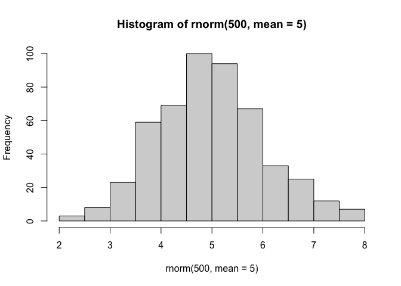
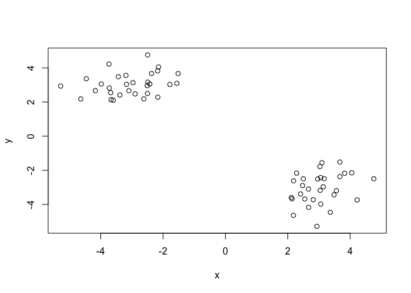
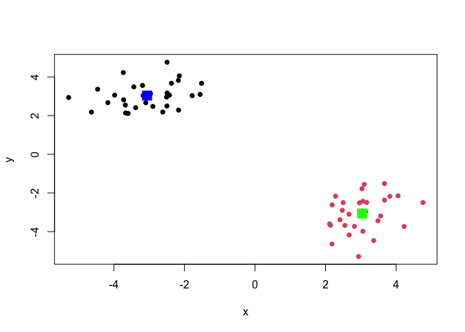
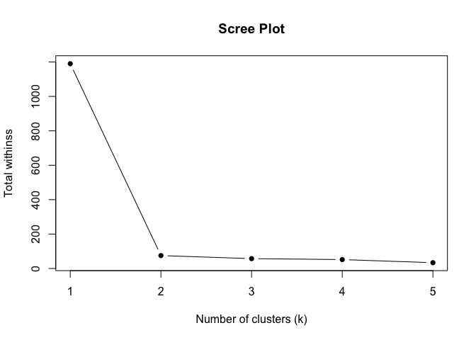
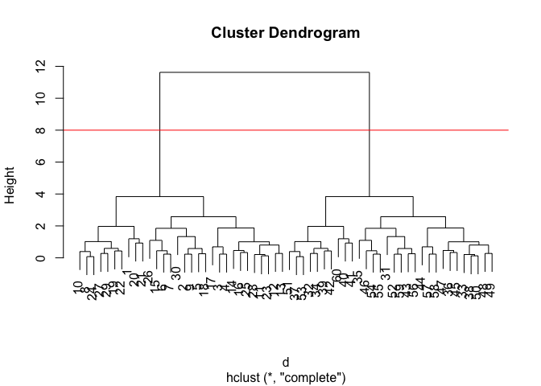
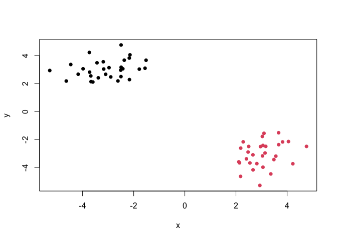
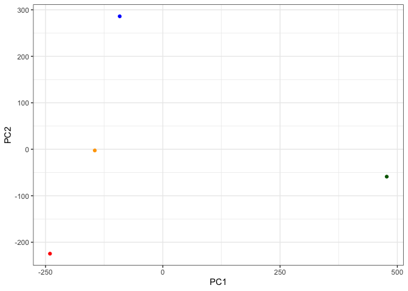
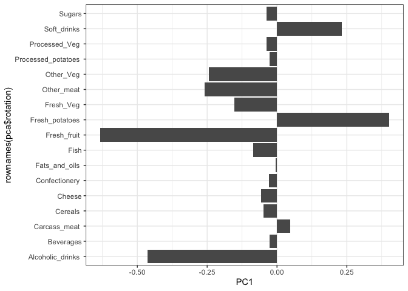

# Class 7: Machine Learning 1
Joseph Girgiss (PID: A17388247)

Today we will explore some fundamental machine learning methods
including clustering and dimensionality reduction.

## K-means clustering

To see how this works let’s first makeup some data to cluster where we
know what the answer should be. We can use the `rnorm()` function to
help here:

``` r
hist(rnorm(500, mean = 5))
```



``` r
x <- c(rnorm(30, mean = -3), rnorm(30, mean =3 ))
y <- rev(x)
```

``` r
x <- cbind(x,y)
```

``` r
plot(x)
```



The function for K-means clustering in “base” R is `kmeans()`

``` r
k <- kmeans(x, centers = 2)
k
```

    K-means clustering with 2 clusters of sizes 30, 30

    Cluster means:
              x         y
    1 -3.061056  3.035276
    2  3.035276 -3.061056

    Clustering vector:
     [1] 1 1 1 1 1 1 1 1 1 1 1 1 1 1 1 1 1 1 1 1 1 1 1 1 1 1 1 1 1 1 2 2 2 2 2 2 2 2
    [39] 2 2 2 2 2 2 2 2 2 2 2 2 2 2 2 2 2 2 2 2 2 2

    Within cluster sum of squares by cluster:
    [1] 37.49219 37.49219
     (between_SS / total_SS =  93.7 %)

    Available components:

    [1] "cluster"      "centers"      "totss"        "withinss"     "tot.withinss"
    [6] "betweenss"    "size"         "iter"         "ifault"      

To get at the results of the returned list object we can use the dollar
`$` syntax.

> 17. How many points are in each cluster?

``` r
k$size
```

    [1] 30 30

> 17. What ‘component’ of your result object details
>
> - cluster size?
> - cluster assignment/membership?
> - cluster cent

``` r
k$cluster
```

     [1] 1 1 1 1 1 1 1 1 1 1 1 1 1 1 1 1 1 1 1 1 1 1 1 1 1 1 1 1 1 1 2 2 2 2 2 2 2 2
    [39] 2 2 2 2 2 2 2 2 2 2 2 2 2 2 2 2 2 2 2 2 2 2

``` r
k$center
```

              x         y
    1 -3.061056  3.035276
    2  3.035276 -3.061056

> Q. Make a clustering results figure of the data colored by cluster
> membership and show cluster centers.

``` r
plot(x, col = k$cluster, pch = 16)
points(k$centers, col = "blue", pch = 15, cex = 2)
```


K-means clustering is very popular as it is very fast and relatively
straight forward: it takes numeric data as input and returns the cluster
membership vector etc.

The “issue” is we tell `kmeans()` how many clusters we want!

> Q. Run k-means again and cluster 4 groups/clusters and plot the
> results as we did above?

``` r
k4 <- kmeans(x, centers = 4)
plot(x, col = k$cluster, pch = 16)
points(k$centers, col = c("blue", "green", "purple", "red"), pch = 15, cex = 2)
```



``` r
wss <- numeric()
for (k in 1:5) {
  wss[k] <- kmeans(x, centers = k)$tot.withinss
}
plot(1:5, wss, type = "b", xlab = "Number of clusters (k)", ylab = "Total withinss", main = "Scree Plot", pch=16)
```



``` r
n <- NULL
for(i in 1:5) {
  n <- c(n, kmeans(x, centers = i)$tot.withinss)
}
plot(n, typ="b", xlab = "Number of clusters (k)", ylab = "Total withinss", main = "Scree Plot", pch=16)
```


The elbow point is the location on a scree plot where the total
within-cluster sum of squares drops sharply as the number of clusters
increases, but then levels off. This point represents the optimal number
of clusters.

## Next Hierarchical Clustering

The main “base” R function for Hierarchical Clustering is called
`hclust()`. Here we can’t just input our data we need to first calculate
a distance matrix (e.g `dist()`) for our data and use this as input to
`hclust()`

``` r
d <- dist(x)
hc <- hclust(d)
hc
```


    Call:
    hclust(d = d)

    Cluster method   : complete 
    Distance         : euclidean 
    Number of objects: 60 

There is a plot method for hclust results. Let’s try it!

``` r
plot(hc)
abline(h=8, col = "red")
```



``` r
cutree(hc, h=8)
```

     [1] 1 1 1 1 1 1 1 1 1 1 1 1 1 1 1 1 1 1 1 1 1 1 1 1 1 1 1 1 1 1 2 2 2 2 2 2 2 2
    [39] 2 2 2 2 2 2 2 2 2 2 2 2 2 2 2 2 2 2 2 2 2 2

To get our cluster “membership” vector (i.e. our main clustering result)
we an “cut” the tree at a given height that yields a given “k” groups.

``` r
grps <- cutree(hc, k=2)
```

> Q. Plot the data with our hclust result coloring

``` r
plot(x, col = grps, pch = 16)
```



# Principal Component Analysis (PCA)

## PCA of UK food data

Import food data from an online CSV file:

``` r
url <- "https://tinyurl.com/UK-foods"
x <- read.csv(url, row.names = 1)
x
```

                        England Wales Scotland N.Ireland
    Cheese                  105   103      103        66
    Carcass_meat            245   227      242       267
    Other_meat              685   803      750       586
    Fish                    147   160      122        93
    Fats_and_oils           193   235      184       209
    Sugars                  156   175      147       139
    Fresh_potatoes          720   874      566      1033
    Fresh_Veg               253   265      171       143
    Other_Veg               488   570      418       355
    Processed_potatoes      198   203      220       187
    Processed_Veg           360   365      337       334
    Fresh_fruit            1102  1137      957       674
    Cereals                1472  1582     1462      1494
    Beverages                57    73       53        47
    Soft_drinks            1374  1256     1572      1506
    Alcoholic_drinks        375   475      458       135
    Confectionery            54    64       62        41

Some base figures:

``` r
barplot(as.matrix(x), beside=T, col=rainbow(nrow(x)))
```


``` r
barplot(as.matrix(x), col=rainbow(nrow(x)))
```


There is one plot that can be useful for small datasets:

``` r
pairs(x, col=rainbow(nrow(x)), pch=16)
```


> Main point: it can be difficult to spot major trends and patterns even
> in relatively small multivariate datasets (here we only have 17
> dimensions, typically we have 1000s).

## PCA to the rescue

The main function in “base” R for PCA is called `prcomp()`

I will take the transpose of out data so the “foods” are in the columns:

``` r
pca <- prcomp( t(x) )
summary(pca)
```

    Importance of components:
                                PC1      PC2      PC3       PC4
    Standard deviation     324.1502 212.7478 73.87622 2.921e-14
    Proportion of Variance   0.6744   0.2905  0.03503 0.000e+00
    Cumulative Proportion    0.6744   0.9650  1.00000 1.000e+00

``` r
cols <- c("orange", "red", "blue", "darkgreen")
plot(pca$x[,1], pca$x[,2], col=cols, pch=16)
```


``` r
library(ggplot2)
```

``` r
ggplot(pca$x) + 
  aes(PC1, PC2) + 
  geom_point(col=cols) +
  theme_bw()
```



``` r
ggplot(pca$rotation) +
  aes(PC1, rownames(pca$rotation)) +
  geom_col() + 
  theme_bw()
```



PCA looks super useful and we will come back to describe this further
next time.
