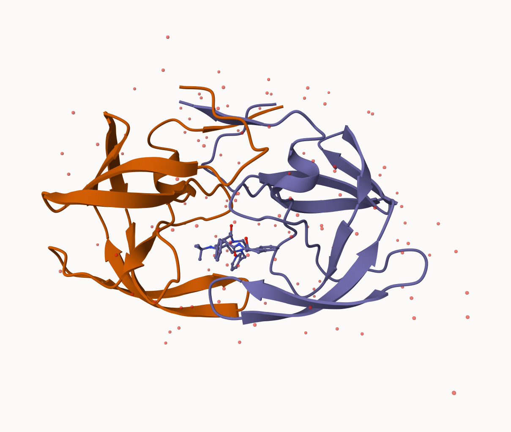
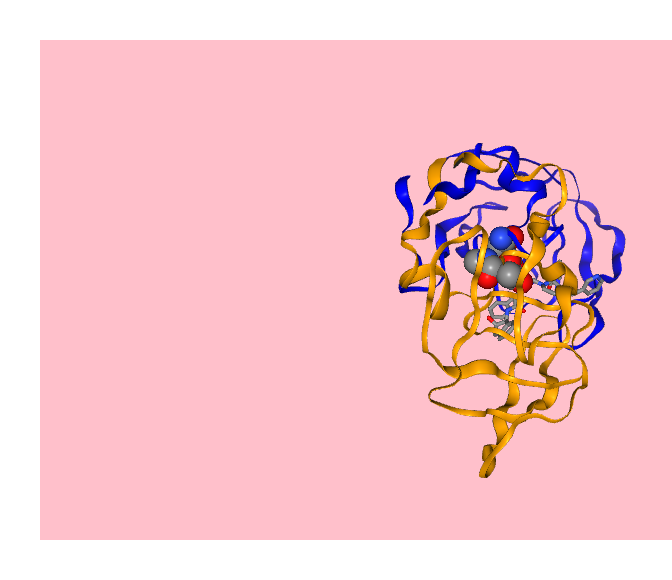
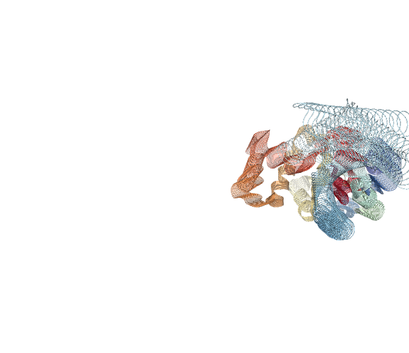
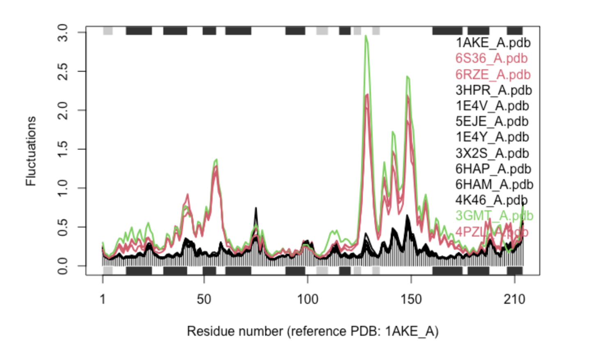

# Class 9: Structural Bioinformatics (pt.1)
Joseph Girgiss (PID: A17388247)

## The PDB Database

The main database for structural biology is called the PDB. Let’s have a
look at what it contains:

Download a CSV file from the PDB site (accessible from “Analyze” \> “PDB
Statistics” \> “by Experimental Method and Molecular Type”

``` r
stats <- read.csv("~/Downloads/Data Export Summary.csv")
```

``` r
stats$Total
```

    [1] "209,886" "13,718"  "15,222"  "4,840"   "222"     "22"     

Oh, these are characters not numeric…

``` r
library(readr)
stats <- read_csv("~/Downloads/Data Export Summary.csv")
stats
```

    # A tibble: 6 × 9
      `Molecular Type`    `X-ray`    EM   NMR Integrative `Multiple methods` Neutron
      <chr>                 <dbl> <dbl> <dbl>       <dbl>              <dbl>   <dbl>
    1 Protein (only)       176204 20299 12708         342                218      83
    2 Protein/Oligosacch…   10279  3385    34           8                 11       1
    3 Protein/NA             9007  5897   287          24                  7       0
    4 Nucleic acid (only)    3066   200  1553           2                 15       3
    5 Other                   173    13    33           3                  0       0
    6 Oligosaccharide (o…      11     0     6           0                  1       0
    # ℹ 2 more variables: Other <dbl>, Total <dbl>

> Q1: What percentage of structures in the PDB are solved by X-Ray and
> Electron Microscopy?

``` r
n.total <- sum(stats$Total)
n.Xray <- sum(stats$`X-ray`)
n.EM <- sum(stats$EM)

xray_percent <- (n.Xray/n.total) * 100
cat(round(xray_percent, 2), "%\n")
```

    81.48 %

``` r
em_percent <- (n.EM/n.total) * 100
cat(round(em_percent, 2), "%\n")
```

    12.22 %

> Q2: What proportion of structures in the PDB are protein?

``` r
protein_only_percent <-sum(stats$Total[1])/n.total * 100
cat(round(protein_only_percent, 2), "%\n")
```

    86.05 %

``` r
n.protein_total <- sum(stats$Total[1:3])
protein_total_percent <-(n.protein_total/n.total) * 100
cat(round(protein_total_percent, 2), "%\n")
```

    97.92 %

> Q3: Type HIV in the PDB website search box on the home page and
> determine how many HIV-1 protease structures are in the current PDB?

There are 1,150 HIV-1 protease structures in the current PDB.

## Exploring PDB structures

Package for structural bioinformatics

``` r
library(bio3d)
hiv <- read.pdb("1hsg")
```

      Note: Accessing on-line PDB file

``` r
hiv
```


     Call:  read.pdb(file = "1hsg")

       Total Models#: 1
         Total Atoms#: 1686,  XYZs#: 5058  Chains#: 2  (values: A B)

         Protein Atoms#: 1514  (residues/Calpha atoms#: 198)
         Nucleic acid Atoms#: 0  (residues/phosphate atoms#: 0)

         Non-protein/nucleic Atoms#: 172  (residues: 128)
         Non-protein/nucleic resid values: [ HOH (127), MK1 (1) ]

       Protein sequence:
          PQITLWQRPLVTIKIGGQLKEALLDTGADDTVLEEMSLPGRWKPKMIGGIGGFIKVRQYD
          QILIEICGHKAIGTVLVGPTPVNIIGRNLLTQIGCTLNFPQITLWQRPLVTIKIGGQLKE
          ALLDTGADDTVLEEMSLPGRWKPKMIGGIGGFIKVRQYDQILIEICGHKAIGTVLVGPTP
          VNIIGRNLLTQIGCTLNF

    + attr: atom, xyz, seqres, helix, sheet,
            calpha, remark, call

Let’s first use the Mol\*viewer to explore this structure.



> Q4: Water molecules normally have 3 atoms. Why do we see just one atom
> per water molecule in this structure?

We see only one atom per water molecule because only the oxygen atom is
resolved and included in the structure; the hydrogens are omitted since
they’re not visible at typical crystallographic resolutions. Their
absence also helps to minimize clustering and improve visibility.

> Q5: There is a critical “conserved” water molecule in the binding
> site. Can you identify this water molecule? What residue number does
> this water molecule have

Residue number: HOH 308

> Q6:

.png)

> Q7: How many amino acid residues are there in this pdb object?

198

> Q8: Name one of the two non-protein residues?

HOH (water) and the MK1 ligand.

> Q9: How many protein chains are in this structure?

There are 2 chains: A and B

## PDB objects in R

``` r
head(hiv$atom)
```

      type eleno elety  alt resid chain resno insert      x      y     z o     b
    1 ATOM     1     N <NA>   PRO     A     1   <NA> 29.361 39.686 5.862 1 38.10
    2 ATOM     2    CA <NA>   PRO     A     1   <NA> 30.307 38.663 5.319 1 40.62
    3 ATOM     3     C <NA>   PRO     A     1   <NA> 29.760 38.071 4.022 1 42.64
    4 ATOM     4     O <NA>   PRO     A     1   <NA> 28.600 38.302 3.676 1 43.40
    5 ATOM     5    CB <NA>   PRO     A     1   <NA> 30.508 37.541 6.342 1 37.87
    6 ATOM     6    CG <NA>   PRO     A     1   <NA> 29.296 37.591 7.162 1 38.40
      segid elesy charge
    1  <NA>     N   <NA>
    2  <NA>     C   <NA>
    3  <NA>     C   <NA>
    4  <NA>     O   <NA>
    5  <NA>     C   <NA>
    6  <NA>     C   <NA>

Extract sequence

``` r
pdbseq(hiv)
```

      1   2   3   4   5   6   7   8   9  10  11  12  13  14  15  16  17  18  19  20 
    "P" "Q" "I" "T" "L" "W" "Q" "R" "P" "L" "V" "T" "I" "K" "I" "G" "G" "Q" "L" "K" 
     21  22  23  24  25  26  27  28  29  30  31  32  33  34  35  36  37  38  39  40 
    "E" "A" "L" "L" "D" "T" "G" "A" "D" "D" "T" "V" "L" "E" "E" "M" "S" "L" "P" "G" 
     41  42  43  44  45  46  47  48  49  50  51  52  53  54  55  56  57  58  59  60 
    "R" "W" "K" "P" "K" "M" "I" "G" "G" "I" "G" "G" "F" "I" "K" "V" "R" "Q" "Y" "D" 
     61  62  63  64  65  66  67  68  69  70  71  72  73  74  75  76  77  78  79  80 
    "Q" "I" "L" "I" "E" "I" "C" "G" "H" "K" "A" "I" "G" "T" "V" "L" "V" "G" "P" "T" 
     81  82  83  84  85  86  87  88  89  90  91  92  93  94  95  96  97  98  99   1 
    "P" "V" "N" "I" "I" "G" "R" "N" "L" "L" "T" "Q" "I" "G" "C" "T" "L" "N" "F" "P" 
      2   3   4   5   6   7   8   9  10  11  12  13  14  15  16  17  18  19  20  21 
    "Q" "I" "T" "L" "W" "Q" "R" "P" "L" "V" "T" "I" "K" "I" "G" "G" "Q" "L" "K" "E" 
     22  23  24  25  26  27  28  29  30  31  32  33  34  35  36  37  38  39  40  41 
    "A" "L" "L" "D" "T" "G" "A" "D" "D" "T" "V" "L" "E" "E" "M" "S" "L" "P" "G" "R" 
     42  43  44  45  46  47  48  49  50  51  52  53  54  55  56  57  58  59  60  61 
    "W" "K" "P" "K" "M" "I" "G" "G" "I" "G" "G" "F" "I" "K" "V" "R" "Q" "Y" "D" "Q" 
     62  63  64  65  66  67  68  69  70  71  72  73  74  75  76  77  78  79  80  81 
    "I" "L" "I" "E" "I" "C" "G" "H" "K" "A" "I" "G" "T" "V" "L" "V" "G" "P" "T" "P" 
     82  83  84  85  86  87  88  89  90  91  92  93  94  95  96  97  98  99 
    "V" "N" "I" "I" "G" "R" "N" "L" "L" "T" "Q" "I" "G" "C" "T" "L" "N" "F" 

``` r
chainA_seq <- pdbseq (trim.pdb(hiv, chain="A"))
```

I can interactively view these PDB objects in R with the new
**bio3dview** package. This is not yet on CRAN.

To install this I can setup **pak** package and use it to install
**bio3dview** from GitHub in my console.

``` r
library(bio3dview)
sel <- atom.select(hiv, resno=25)
view.pdb(hiv, highlight = sel,
         highlight.style = "spacefill",
         colorScheme = "chain", 
         col=c("blue", "orange"),
         backgroundColor = "pink")
```

    file:////private/var/folders/vv/r72vb1jj0455_jkfvm0hlhdh0000gn/T/RtmpXRjhwX/file8d176763ac6b/widget8d1740ccd9d4.html screenshot completed



install.packages(“bio3d”) install.packages(“NGLVieweR”)

install.packages(“pak”) pak::pak(“bioboot/bio3dview”)

install.packages(“BiocManager”) BiocManager::install(“msa”)

> Q10. Which of the packages above is found only on BioConductor and not
> CRAN?

The msa package is only found on BioConductor.

> Q11. Which of the above packages is not found on BioConductor or
> CRAN?:

bio3dview; it was installed from GitHub using
pak::pak(“bioboot/bio3dview”).

> Q12. True or False? Functions from the pak package can be used to
> install packages from GitHub and BitBucket?

True

## Predict protein flexibility

We can run a bioinformatics calculation to predict protein dynamics -
i.e. functional motions.

We will use the `nma()` function

``` r
adk <- read.pdb("6s36")
```

      Note: Accessing on-line PDB file
       PDB has ALT records, taking A only, rm.alt=TRUE

``` r
adk
```


     Call:  read.pdb(file = "6s36")

       Total Models#: 1
         Total Atoms#: 1898,  XYZs#: 5694  Chains#: 1  (values: A)

         Protein Atoms#: 1654  (residues/Calpha atoms#: 214)
         Nucleic acid Atoms#: 0  (residues/phosphate atoms#: 0)

         Non-protein/nucleic Atoms#: 244  (residues: 244)
         Non-protein/nucleic resid values: [ CL (3), HOH (238), MG (2), NA (1) ]

       Protein sequence:
          MRIILLGAPGAGKGTQAQFIMEKYGIPQISTGDMLRAAVKSGSELGKQAKDIMDAGKLVT
          DELVIALVKERIAQEDCRNGFLLDGFPRTIPQADAMKEAGINVDYVLEFDVPDELIVDKI
          VGRRVHAPSGRVYHVKFNPPKVEGKDDVTGEELTTRKDDQEETVRKRLVEYHQMTAPLIG
          YYSKEAEAGNTKYAKVDGTKPVAEVRADLEKILG

    + attr: atom, xyz, seqres, helix, sheet,
            calpha, remark, call

``` r
m <- nma(adk)
```

     Building Hessian...        Done in 0.019 seconds.
     Diagonalizing Hessian...   Done in 0.289 seconds.

``` r
plot(m)
```


Generate a “trajectory” of predicted motion

``` r
mktrj(m, file="ADK_nma.pdb")
view.nma(m)
```

    file:////private/var/folders/vv/r72vb1jj0455_jkfvm0hlhdh0000gn/T/RtmpXRjhwX/file8d177734ca8d/widget8d172ade2c1f.html screenshot completed



``` r
library(bio3d)
aa <- get.seq("1ake_A")
aa
```

> Q13. How many amino acids are in this sequence, i.e. how long is this
> sequence?

214

## Normal mode analysis

``` r
library(bio3d)
aa <- get.seq("1ake_A")

#Blast or hmmer search 
b <- blast.pdb(aa) 
```

``` r
#Plot a summary of search results
hits <- plot(b)

#List out some 'top hits'
head(hits$pdb.id)
hits <- NULL
hits$pdb.id <- c('1AKE_A','6S36_A','6RZE_A','3HPR_A','1E4V_A','5EJE_A','1E4Y_A','3X2S_A','6HAP_A','6HAM_A','4K46_A','3GMT_A','4PZL_A')

#Download releated PDB files
files <- get.pdb(hits$pdb.id, path="pdbs", split=TRUE, gzip=TRUE)

#Align releated PDBs
pdbs <- pdbaln(files, fit = TRUE, exefile="msa")

#Vector containing PDB codes for figure axis
ids <- basename.pdb(pdbs$id)

#Draw schematic alignment
plot(pdbs, labels=ids)
```

``` r
# NMA of all structures
rd <- rmsd(pdbs)
hc.rd <- hclust(dist(rd))
grps.rd <- cutree(hc.rd, k=3)
modes <- nma(pdbs)
plot(modes, pdbs, col=grps.rd)
```



> Q14. What do you note about this plot? Are the black and colored lines
> similar or different? Where do you think they differ most and why?

The plot compares the flexibility (Fluctuations) of several protein
structures across their length (Residue number). The main observation is
a stark difference in flexibility between two groups of structures.

The red and green lines show much higher fluctuations (peaks up to 3.0)
than the black lines (peaks rarely above 0.5). This means the proteins
represented by the colored lines are significantly more flexible and
dynamic.

Despite the difference in size, both the black and colored lines show
peaks at the same locations (around residues 50-60, 125-145, and
150-160). This indicates that the same protein regions are the most
flexible in all structures.

The lines differ most dramatically in the regions of highest movement:
Residues 125-145 and 150-160. This may be because the black lines
represent the structures in a closed/ligand-bound state where the ligand
“locks” the loops in place. The red and green lines may be the open
state/without a ligand, allowing the loops to move freely and leading to
larger fluctuations.
