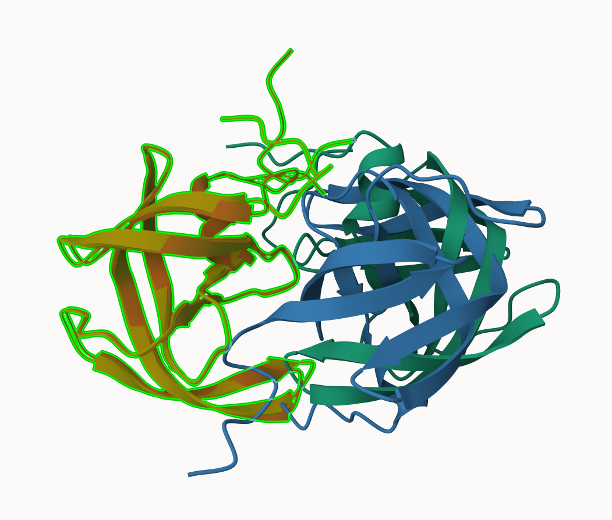
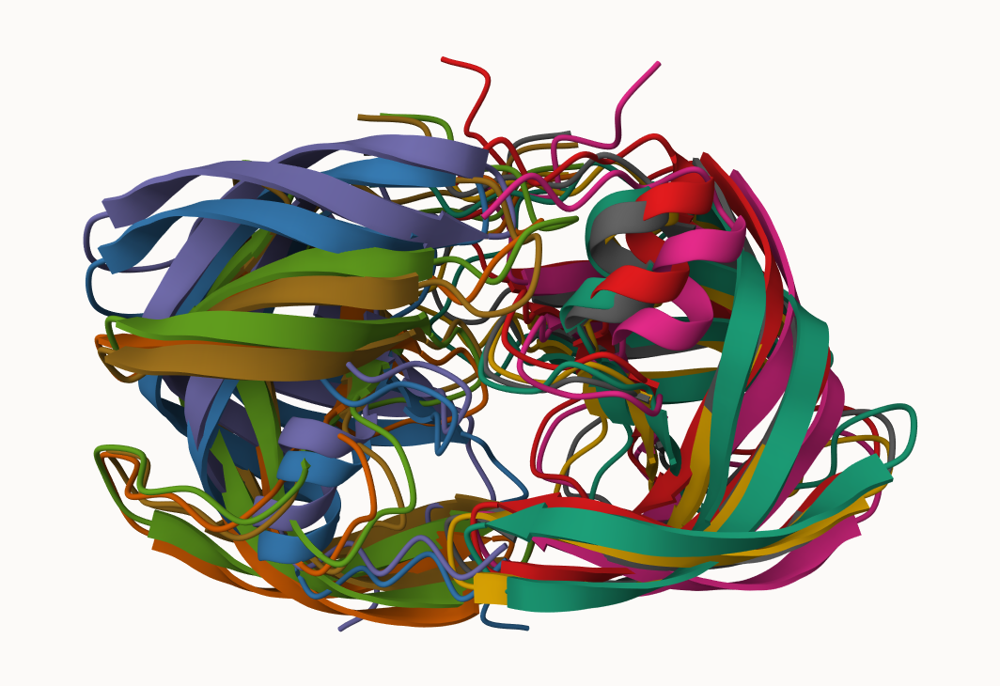
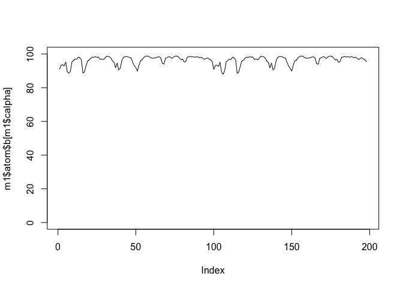
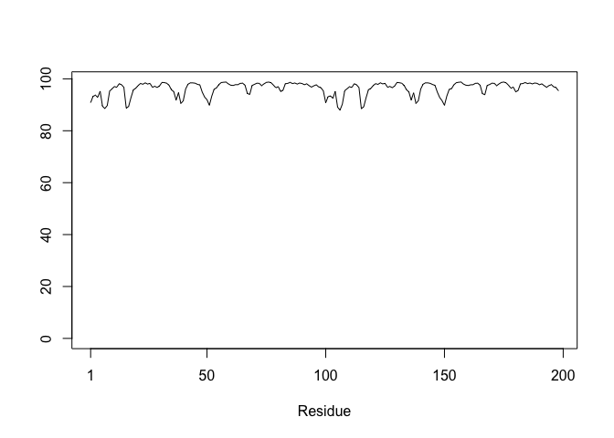

# Class 11: Structural Bioinformatic pt2
Joseph Girgiss (PID: A17388247)

- [AlphaFold Database](#alphafold-database)
- [Generating your own structure
  predictions](#generating-your-own-structure-predictions)
- [Custom analysis of resulting
  models](#custom-analysis-of-resulting-models)
- [Residue conservation from alignment
  file](#residue-conservation-from-alignment-file)

## AlphaFold Database

The EBI maintains the largest database of AlphaFold structure prediction
models at: https://alphafold.ebi.ac.uk/

From last class (before Halloween) we saw that the PDB had 244,290 (Oct
2025).

The total number of protein sequences in UniProtKB is 199,579,901.

> **Key Point**: This is a tiny fraction of sequence space that has
> structural coverage (0.12%).

``` r
244290/199579901 * 100
```

    [1] 0.1224021

AFDB is attempting to address this gap…

There are two “Quality Scores” from AlphaFold. One for residues
(i.e. each amino acid) called **plDDT** score. The second Predicted
Alignment Error (**PAE**) which measures the confidence in the relative
position of two residues (i.e. a score for every pair of residues).

## Generating your own structure predictions






## Custom analysis of resulting models

Read key result files into R. The first thing I need to know is what my
results directory/folder is called (i.e. it’s name is different for
every AlphaFold run/job).

``` r
results_dir <- "HIVPR_dimer_23119/"

# File names for all PDB models
pdb_files <- list.files(path=results_dir,
                        pattern="*.pdb",
                        full.names = TRUE)

# Print our PDB file names
basename(pdb_files)
```

    [1] "HIVPR_dimer_23119_unrelaxed_rank_001_alphafold2_multimer_v3_model_4_seed_000.pdb"
    [2] "HIVPR_dimer_23119_unrelaxed_rank_002_alphafold2_multimer_v3_model_1_seed_000.pdb"
    [3] "HIVPR_dimer_23119_unrelaxed_rank_003_alphafold2_multimer_v3_model_5_seed_000.pdb"
    [4] "HIVPR_dimer_23119_unrelaxed_rank_004_alphafold2_multimer_v3_model_2_seed_000.pdb"
    [5] "HIVPR_dimer_23119_unrelaxed_rank_005_alphafold2_multimer_v3_model_3_seed_000.pdb"

``` r
library(bio3d)

m1 <- read.pdb(pdb_files[1])
m1
```


     Call:  read.pdb(file = pdb_files[1])

       Total Models#: 1
         Total Atoms#: 1514,  XYZs#: 4542  Chains#: 2  (values: A B)

         Protein Atoms#: 1514  (residues/Calpha atoms#: 198)
         Nucleic acid Atoms#: 0  (residues/phosphate atoms#: 0)

         Non-protein/nucleic Atoms#: 0  (residues: 0)
         Non-protein/nucleic resid values: [ none ]

       Protein sequence:
          PQITLWQRPLVTIKIGGQLKEALLDTGADDTVLEEMSLPGRWKPKMIGGIGGFIKVRQYD
          QILIEICGHKAIGTVLVGPTPVNIIGRNLLTQIGCTLNFPQITLWQRPLVTIKIGGQLKE
          ALLDTGADDTVLEEMSLPGRWKPKMIGGIGGFIKVRQYDQILIEICGHKAIGTVLVGPTP
          VNIIGRNLLTQIGCTLNF

    + attr: atom, xyz, calpha, call

``` r
head(m1$atom)
```

      type eleno elety  alt resid chain resno insert      x      y      z o     b
    1 ATOM     1     N <NA>   PRO     A     1   <NA> 16.922 -3.898 -6.254 1 90.81
    2 ATOM     2    CA <NA>   PRO     A     1   <NA> 16.891 -2.467 -6.562 1 90.81
    3 ATOM     3     C <NA>   PRO     A     1   <NA> 16.406 -1.617 -5.395 1 90.81
    4 ATOM     4    CB <NA>   PRO     A     1   <NA> 15.930 -2.373 -7.746 1 90.81
    5 ATOM     5     O <NA>   PRO     A     1   <NA> 15.820 -2.146 -4.445 1 90.81
    6 ATOM     6    CG <NA>   PRO     A     1   <NA> 15.031 -3.559 -7.598 1 90.81
      segid elesy charge
    1  <NA>     N   <NA>
    2  <NA>     C   <NA>
    3  <NA>     C   <NA>
    4  <NA>     C   <NA>
    5  <NA>     O   <NA>
    6  <NA>     C   <NA>

``` r
m1$atom$b[m1$calpha]
```

      [1] 90.81 93.25 93.69 92.88 95.25 89.44 88.56 89.75 95.25 96.19 97.00 96.75
     [13] 98.12 97.75 96.69 88.69 89.38 92.81 95.75 96.38 97.44 98.19 97.94 98.44
     [25] 98.00 98.25 96.75 97.12 96.69 97.25 98.62 98.56 98.31 97.56 95.81 95.06
     [37] 91.81 94.69 90.50 91.56 96.06 97.94 98.44 98.44 98.31 97.88 97.62 94.88
     [49] 93.00 91.94 89.81 93.31 96.00 96.50 97.81 98.56 98.69 98.75 98.06 97.56
     [61] 97.44 97.75 97.75 98.25 98.31 97.56 94.38 94.00 97.44 97.88 98.31 98.25
     [73] 97.38 98.06 98.62 98.75 98.50 97.56 96.56 97.00 95.12 95.62 98.12 98.25
     [85] 98.62 98.19 98.38 98.00 98.38 98.19 97.75 98.06 97.38 96.81 97.31 97.69
     [97] 96.94 96.56 95.31 90.81 93.12 93.44 92.50 95.12 89.12 87.94 90.25 95.44
    [109] 96.19 96.94 96.69 98.12 97.69 96.62 88.50 89.25 92.75 95.81 96.31 97.44
    [121] 98.12 97.88 98.44 98.06 98.25 96.75 97.06 96.62 97.19 98.62 98.50 98.31
    [133] 97.50 95.81 95.00 91.81 94.62 90.50 91.62 96.06 97.94 98.44 98.44 98.25
    [145] 97.81 97.50 94.88 92.81 91.56 89.81 93.38 95.94 96.25 97.75 98.50 98.69
    [157] 98.75 98.00 97.56 97.44 97.69 97.75 98.25 98.31 97.56 94.31 93.88 97.44
    [169] 97.81 98.31 98.25 97.38 98.06 98.62 98.75 98.44 97.50 96.38 96.81 95.00
    [181] 95.50 98.06 98.19 98.56 98.19 98.38 98.06 98.38 98.25 97.75 98.06 97.38
    [193] 96.75 97.38 97.75 96.94 96.62 95.38

``` r
plot(m1$atom$b[m1$calpha], typ="l", ylim=c(0,100))
```



``` r
plot.bio3d(m1$atom$b[m1$calpha], typ="l")
```



## Residue conservation from alignment file

``` r
aln_file <- list.files(path=results_dir,
                       pattern=".a3m$",
                        full.names = TRUE)
aln_file
```

    [1] "HIVPR_dimer_23119//HIVPR_dimer_23119.a3m"

Read this into R

``` r
aln <- read.fasta(aln_file[1], to.upper = TRUE)
```

    [1] " ** Duplicated sequence id's: 101 **"
    [2] " ** Duplicated sequence id's: 101 **"

How many sequences are in this alignment

``` r
dim(aln$ali)
```

    [1] 5397  132

We can score residue conservation in the alignment with the conserv()
function.

``` r
# Read a reference PDB structure
pdb <- read.pdb("1hsg")
```

      Note: Accessing on-line PDB file

``` r
sim <- conserv(aln)
plotb3(sim[1:99], sse=trim.pdb(pdb, chain="A"),
       ylab="Conservation Score")
```


Note the conserved Active Site residues D25, T26, G27, A28. These
positions will stand out if we generate a consensus sequence with a high
cutoff value:

``` r
con <- consensus(aln, cutoff = 0.9)
con$seq
```

      [1] "-" "-" "-" "-" "-" "-" "-" "-" "-" "-" "-" "-" "-" "-" "-" "-" "-" "-"
     [19] "-" "-" "-" "-" "-" "-" "D" "T" "G" "A" "-" "-" "-" "-" "-" "-" "-" "-"
     [37] "-" "-" "-" "-" "-" "-" "-" "-" "-" "-" "-" "-" "-" "-" "-" "-" "-" "-"
     [55] "-" "-" "-" "-" "-" "-" "-" "-" "-" "-" "-" "-" "-" "-" "-" "-" "-" "-"
     [73] "-" "-" "-" "-" "-" "-" "-" "-" "-" "-" "-" "-" "-" "-" "-" "-" "-" "-"
     [91] "-" "-" "-" "-" "-" "-" "-" "-" "-" "-" "-" "-" "-" "-" "-" "-" "-" "-"
    [109] "-" "-" "-" "-" "-" "-" "-" "-" "-" "-" "-" "-" "-" "-" "-" "-" "-" "-"
    [127] "-" "-" "-" "-" "-" "-"
