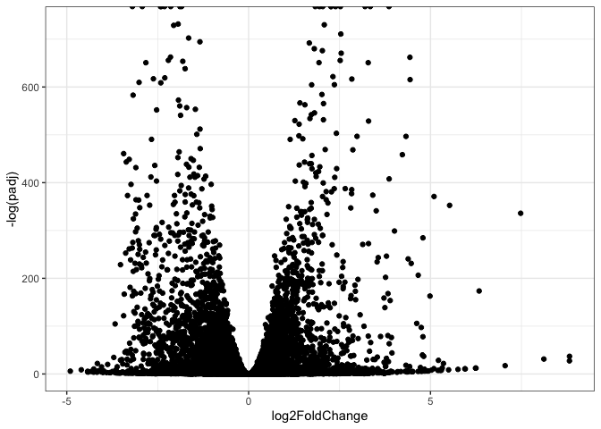
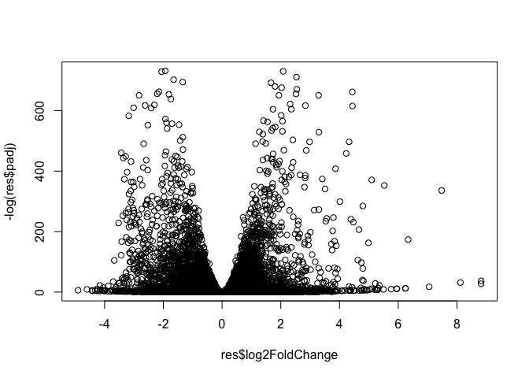
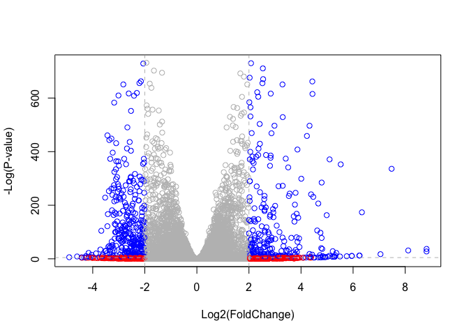

# Class 14: RNASeq mini project
Joseph Girgiss (PID: A17388247)

- [Background](#background)
- [Data Import](#data-import)
  - [Remove zero count genes](#remove-zero-count-genes)
- [DESeq Analysis](#deseq-analysis)
- [Data Visualization](#data-visualization)
- [Add Annotation](#add-annotation)
- [Pathway Analysis](#pathway-analysis)
  - [Kegg pathway analysis](#kegg-pathway-analysis)
  - [GO terms](#go-terms)
  - [Reactome Analysis](#reactome-analysis)
- [Save our results](#save-our-results)

## Background

Here we work through a complete RNASeq analysis project. The input data
comes from a knock-down experiment of a HOX gene.

## Data Import

Reading the `counts` and `metadata` csv files Check on data structure

``` r
counts <- read.csv("GSE37704_featurecounts.csv", row.names = 1, )
metadata <- read.csv("GSE37704_metadata.csv")

head(counts)
```

                    length SRR493366 SRR493367 SRR493368 SRR493369 SRR493370
    ENSG00000186092    918         0         0         0         0         0
    ENSG00000279928    718         0         0         0         0         0
    ENSG00000279457   1982        23        28        29        29        28
    ENSG00000278566    939         0         0         0         0         0
    ENSG00000273547    939         0         0         0         0         0
    ENSG00000187634   3214       124       123       205       207       212
                    SRR493371
    ENSG00000186092         0
    ENSG00000279928         0
    ENSG00000279457        46
    ENSG00000278566         0
    ENSG00000273547         0
    ENSG00000187634       258

``` r
head(metadata)
```

             id     condition
    1 SRR493366 control_sirna
    2 SRR493367 control_sirna
    3 SRR493368 control_sirna
    4 SRR493369      hoxa1_kd
    5 SRR493370      hoxa1_kd
    6 SRR493371      hoxa1_kd

Some book-keeping is required as there looks to be a mis-match between
counts columns and metadata rows.

``` r
ncol(counts)
```

    [1] 7

``` r
nrow(metadata)
```

    [1] 6

Looks like we need to get rid of the first “length” column of our
`counts` object.

``` r
cleancounts <- counts[, -1]
head(cleancounts)
```

                    SRR493366 SRR493367 SRR493368 SRR493369 SRR493370 SRR493371
    ENSG00000186092         0         0         0         0         0         0
    ENSG00000279928         0         0         0         0         0         0
    ENSG00000279457        23        28        29        29        28        46
    ENSG00000278566         0         0         0         0         0         0
    ENSG00000273547         0         0         0         0         0         0
    ENSG00000187634       124       123       205       207       212       258

``` r
ncol(cleancounts)
```

    [1] 6

### Remove zero count genes

There are lots of genes with zero counts. We can remove these for future
analysis.

``` r
to.keep.inds <- rowSums(cleancounts) > 0
nonzero_counts <- cleancounts[to.keep.inds,]
```

## DESeq Analysis

Load the package

``` r
library(DESeq2)
```

Setup DESeq object

``` r
dds <- DESeqDataSetFromMatrix(countData = nonzero_counts, 
                              colData = metadata, 
                              design = ~condition)
```

    Warning in DESeqDataSet(se, design = design, ignoreRank): some variables in
    design formula are characters, converting to factors

Run DESeq

``` r
dds <- DESeq(dds)
```

    estimating size factors

    estimating dispersions

    gene-wise dispersion estimates

    mean-dispersion relationship

    final dispersion estimates

    fitting model and testing

Get results

``` r
res <- results(dds)
head(res)
```

    log2 fold change (MLE): condition hoxa1 kd vs control sirna 
    Wald test p-value: condition hoxa1 kd vs control sirna 
    DataFrame with 6 rows and 6 columns
                     baseMean log2FoldChange     lfcSE       stat      pvalue
                    <numeric>      <numeric> <numeric>  <numeric>   <numeric>
    ENSG00000279457   29.9136      0.1792571 0.3248215   0.551863 5.81042e-01
    ENSG00000187634  183.2296      0.4264571 0.1402658   3.040350 2.36304e-03
    ENSG00000188976 1651.1881     -0.6927205 0.0548465 -12.630156 1.43993e-36
    ENSG00000187961  209.6379      0.7297556 0.1318599   5.534326 3.12428e-08
    ENSG00000187583   47.2551      0.0405765 0.2718928   0.149237 8.81366e-01
    ENSG00000187642   11.9798      0.5428105 0.5215598   1.040744 2.97994e-01
                           padj
                      <numeric>
    ENSG00000279457 6.86555e-01
    ENSG00000187634 5.15718e-03
    ENSG00000188976 1.76553e-35
    ENSG00000187961 1.13413e-07
    ENSG00000187583 9.19031e-01
    ENSG00000187642 4.03379e-01

Summary of results:

``` r
summary(res)
```


    out of 15975 with nonzero total read count
    adjusted p-value < 0.1
    LFC > 0 (up)       : 4349, 27%
    LFC < 0 (down)     : 4396, 28%
    outliers [1]       : 0, 0%
    low counts [2]     : 1237, 7.7%
    (mean count < 0)
    [1] see 'cooksCutoff' argument of ?results
    [2] see 'independentFiltering' argument of ?results

## Data Visualization

Volcano plot

``` r
library(ggplot2)

ggplot(res) + 
  aes(log2FoldChange, -log(padj)) +
        geom_point() + 
  theme_bw()
```

    Warning: Removed 1237 rows containing missing values or values outside the scale range
    (`geom_point()`).



``` r
plot( res$log2FoldChange, -log(res$padj) )
```



Add threshfold lines for fold-change and P-value and color our subset of
genes that makes these threshold cut-offs in the plot.

``` r
# Setup our custom point color vector 
mycols <- rep("gray", nrow(res))
mycols[ abs(res$log2FoldChange) > 2 ]  <- "red" 

inds <- (res$padj < 0.01) & (abs(res$log2FoldChange) > 2 )
mycols[ inds ] <- "blue"

# Volcano plot with custom colors 
plot( res$log2FoldChange,  -log(res$padj), 
 col=mycols, xlab="Log2(FoldChange)", ylab="-Log(P-value)")

# Cut-off lines
abline(v=c(-2,2), col="gray", lty=2)
abline(h=-log(0.01), col="gray", lty=2)
```



## Add Annotation

Add gene symbols and entrez ids

``` r
library(AnnotationDbi)
library(org.Hs.eg.db)
```

``` r
res$entrez <- mapIds(keys = row.names(res), # our current Ids
       keytype = "ENSEMBL" ,  # the format of our Ids
       x = org.Hs.eg.db,      # where to get the mappings from 
       column = "ENTREZID"      # the format/DB to map to 
      )

res$symbol <- mapIds(keys = row.names(res), # our current Ids
       keytype = "ENSEMBL" ,  # the format of our Ids
       x = org.Hs.eg.db,      # where to get the mappings from 
       column = "SYMBOL"      # the format/DB to map to 
      )

res$GENENAME <- mapIds(keys = row.names(res), # our current Ids
       keytype = "ENSEMBL" ,  # the format of our Ids
       x = org.Hs.eg.db,      # where to get the mappings from 
       column = "GENENAME"      # the format/DB to map to 
      )
head(res)
```

    log2 fold change (MLE): condition hoxa1 kd vs control sirna 
    Wald test p-value: condition hoxa1 kd vs control sirna 
    DataFrame with 6 rows and 9 columns
                     baseMean log2FoldChange     lfcSE       stat      pvalue
                    <numeric>      <numeric> <numeric>  <numeric>   <numeric>
    ENSG00000279457   29.9136      0.1792571 0.3248215   0.551863 5.81042e-01
    ENSG00000187634  183.2296      0.4264571 0.1402658   3.040350 2.36304e-03
    ENSG00000188976 1651.1881     -0.6927205 0.0548465 -12.630156 1.43993e-36
    ENSG00000187961  209.6379      0.7297556 0.1318599   5.534326 3.12428e-08
    ENSG00000187583   47.2551      0.0405765 0.2718928   0.149237 8.81366e-01
    ENSG00000187642   11.9798      0.5428105 0.5215598   1.040744 2.97994e-01
                           padj      entrez      symbol               GENENAME
                      <numeric> <character> <character>            <character>
    ENSG00000279457 6.86555e-01          NA          NA                     NA
    ENSG00000187634 5.15718e-03      148398      SAMD11 sterile alpha motif ..
    ENSG00000188976 1.76553e-35       26155       NOC2L NOC2 like nucleolar ..
    ENSG00000187961 1.13413e-07      339451      KLHL17 kelch like family me..
    ENSG00000187583 9.19031e-01       84069     PLEKHN1 pleckstrin homology ..
    ENSG00000187642 4.03379e-01       84808       PERM1 PPARGC1 and ESRR ind..

## Pathway Analysis

### Kegg pathway analysis

Run gage analysis

``` r
library(gage)
library(gageData)
library(pathview)
```

We need a named vector of fold-change values as inputs for gage.

``` r
foldchanges <- res$log2FoldChange
names(foldchanges) <- res$entrez
head(foldchanges)
```

           <NA>      148398       26155      339451       84069       84808 
     0.17925708  0.42645712 -0.69272046  0.72975561  0.04057653  0.54281049 

``` r
data(kegg.sets.hs)

keggres = gage(foldchanges, gsets=kegg.sets.hs)
```

``` r
head(keggres$less, 2)
```

                                p.geomean stat.mean        p.val       q.val
    hsa04110 Cell cycle      8.995727e-06 -4.378644 8.995727e-06 0.001889103
    hsa03030 DNA replication 9.424076e-05 -3.951803 9.424076e-05 0.009841047
                             set.size         exp1
    hsa04110 Cell cycle           121 8.995727e-06
    hsa03030 DNA replication       36 9.424076e-05

``` r
pathview(pathway.id = "hsa04110", gene.data = foldchanges)
```

    'select()' returned 1:1 mapping between keys and columns

    Info: Working in directory /Users/josephgirgiss/Desktop/BIMM_143/bimm143_github/class14

    Info: Writing image file hsa04110.pathview.png

``` r
pathview(pathway.id = "hsa03030", gene.data = foldchanges)
```

    'select()' returned 1:1 mapping between keys and columns

    Info: Working in directory /Users/josephgirgiss/Desktop/BIMM_143/bimm143_github/class14

    Info: Writing image file hsa03030.pathview.png


> Q. Can you do the same procedure as above to plot the pathview figures
> for the top 5 down-regulated pathways?

hsa04110 and hsa03030 are seen above

``` r
## Focus on top 5 down-regulated pathways 
keggrespathways <- rownames(keggres$less)[1:5]

# Extract the 8 character long IDs part of each string
keggresids = substr(keggrespathways, start=1, stop=8)
keggresids
```

    [1] "hsa04110" "hsa03030" "hsa05130" "hsa03013" "hsa03440"

``` r
pathview(gene.data=foldchanges, pathway.id=keggresids, species="hsa")
```

    'select()' returned 1:1 mapping between keys and columns

    Info: Working in directory /Users/josephgirgiss/Desktop/BIMM_143/bimm143_github/class14

    Info: Writing image file hsa04110.pathview.png

    'select()' returned 1:1 mapping between keys and columns

    Info: Working in directory /Users/josephgirgiss/Desktop/BIMM_143/bimm143_github/class14

    Info: Writing image file hsa03030.pathview.png

    'select()' returned 1:1 mapping between keys and columns

    Info: Working in directory /Users/josephgirgiss/Desktop/BIMM_143/bimm143_github/class14

    Info: Writing image file hsa05130.pathview.png

    'select()' returned 1:1 mapping between keys and columns

    Info: Working in directory /Users/josephgirgiss/Desktop/BIMM_143/bimm143_github/class14

    Info: Writing image file hsa03013.pathview.png

    'select()' returned 1:1 mapping between keys and columns

    Info: Working in directory /Users/josephgirgiss/Desktop/BIMM_143/bimm143_github/class14

    Info: Writing image file hsa03440.pathview.png


### GO terms

Same analysis but using GO genesets rather than KEGG

``` r
data(go.sets.hs)
data(go.subs.hs)

# Focus on Biological Process subset of GO
gobpsets = go.sets.hs[go.subs.hs$BP]

gobpres = gage(foldchanges, gsets=gobpsets, same.dir=TRUE)
```

``` r
head(gobpres$less)
```

                                                p.geomean stat.mean        p.val
    GO:0048285 organelle fission             1.536227e-15 -8.063910 1.536227e-15
    GO:0000280 nuclear division              4.286961e-15 -7.939217 4.286961e-15
    GO:0007067 mitosis                       4.286961e-15 -7.939217 4.286961e-15
    GO:0000087 M phase of mitotic cell cycle 1.169934e-14 -7.797496 1.169934e-14
    GO:0007059 chromosome segregation        2.028624e-11 -6.878340 2.028624e-11
    GO:0000236 mitotic prometaphase          1.729553e-10 -6.695966 1.729553e-10
                                                    q.val set.size         exp1
    GO:0048285 organelle fission             5.841698e-12      376 1.536227e-15
    GO:0000280 nuclear division              5.841698e-12      352 4.286961e-15
    GO:0007067 mitosis                       5.841698e-12      352 4.286961e-15
    GO:0000087 M phase of mitotic cell cycle 1.195672e-11      362 1.169934e-14
    GO:0007059 chromosome segregation        1.658603e-08      142 2.028624e-11
    GO:0000236 mitotic prometaphase          1.178402e-07       84 1.729553e-10

### Reactome Analysis

Lots of folks like the reactome web interface. We can also run this as
an R function but lets look at the web interface first
\<https://reactome.org/PathwayBrowser/#TOOL=AT \>

The website wants a text file with one gene symbol per line of the genes
you want to map to pathways.

``` r
sig_genes <- res[res$padj <= 0.05 & !is.na(res$padj), "symbol"]
head(sig_genes)
```

    ENSG00000187634 ENSG00000188976 ENSG00000187961 ENSG00000188290 ENSG00000187608 
           "SAMD11"         "NOC2L"        "KLHL17"          "HES4"         "ISG15" 
    ENSG00000188157 
             "AGRN" 

``` r
print(paste("Total number of significant genes:", length(sig_genes)))
```

    [1] "Total number of significant genes: 8147"

``` r
write.table(sig_genes, file="significant_genes.txt", row.names=FALSE, col.names=FALSE, quote=FALSE)
```

> Q. What pathway has the most significant “Entities p-value”? Do the
> most significant pathways listed match your previous KEGG results?
> What factors could cause differences between the two methods?

``` r
# Top KEGG upregulated pathway (lowest p-value)
kegg_top_up <- rownames(keggres$greater)[ which.min(keggres$greater[ , "p.val"]) ]

# Top KEGG downregulated pathway (lowest p-value)
kegg_top_down <- rownames(keggres$less)[ which.min(keggres$less[ , "p.val"]) ]

kegg_top_up
```

    [1] "hsa04060 Cytokine-cytokine receptor interaction"

``` r
kegg_top_down
```

    [1] "hsa04110 Cell cycle"

``` r
# Top GO BP upregulated term
go_top_up <- rownames(gobpres$greater)[ which.min(gobpres$greater[ , "p.val"]) ]

# Top GO BP downregulated term
go_top_down <- rownames(gobpres$less)[ which.min(gobpres$less[ , "p.val"]) ]

go_top_up
```

    [1] "GO:0007156 homophilic cell adhesion"

``` r
go_top_down
```

    [1] "GO:0048285 organelle fission"

``` r
top_up_pval <- head(rownames(keggres$greater),1) 
top_down_pval <- head(rownames(keggres$less), 1) 
top_up_pval 
```

    [1] "hsa04060 Cytokine-cytokine receptor interaction"

``` r
top_down_pval 
```

    [1] "hsa04110 Cell cycle"

``` r
go_top_up_pval <- head(rownames(gobpres$greater),1) 
go_top_down_pval <- head(rownames(gobpres$less), 1) 
go_top_up_pval 
```

    [1] "GO:0007156 homophilic cell adhesion"

``` r
go_top_down_pval
```

    [1] "GO:0048285 organelle fission"

Cytokine-cytokine receptor interaction and homophilic cell adhesion are
the most significant up-regulated gene for Kegg and for Go,
respectively. Cell cycle and organelle fission are the most significant
down-regulated gene for Kegg and for Go, respectively. While both the
up-regulated gene reflect enhanced cell–cell communication and
coordinated cellular responses, and both the down-regulated genes are
related to cell-cycle progression, differences in gene “hits” may arise
from differences in how each method categorizes biology (Kegg = general
pathway, GO = function-based) as well as different gene set sizes.

## Save our results

``` r
res = res[order(res$pvalue),]
write.csv(res, file = "myresults.csv")
```
