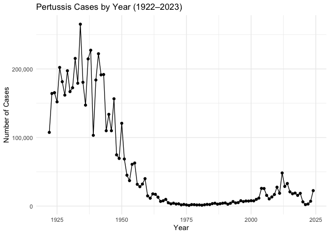
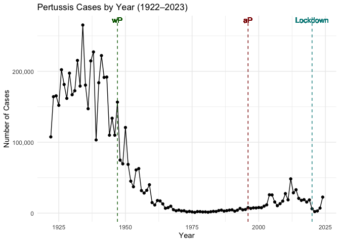
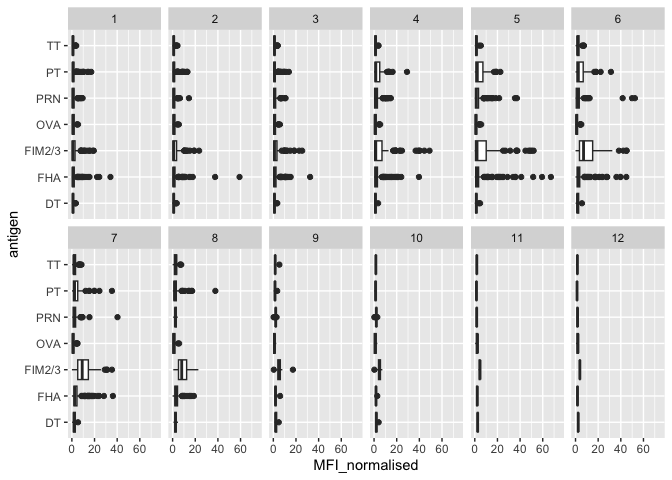
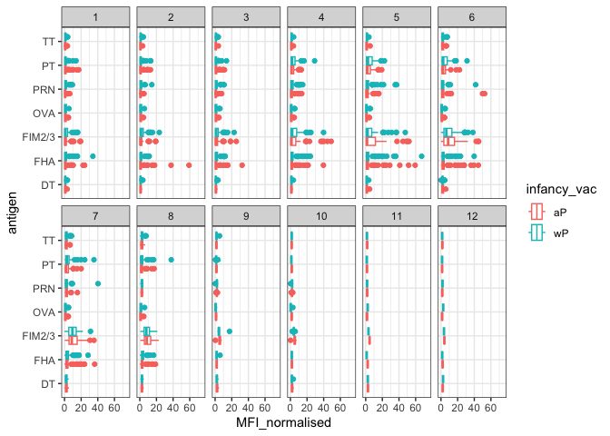
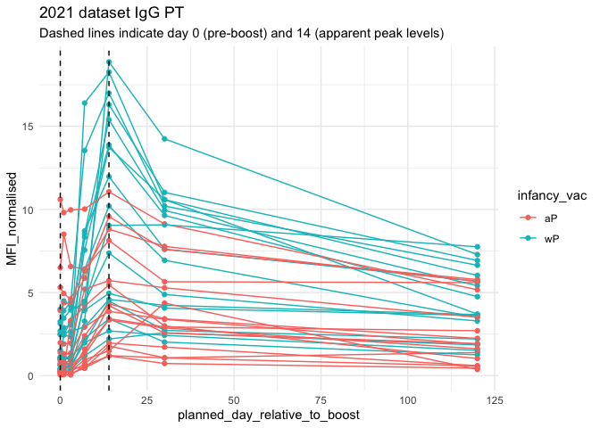

# Class 19: Pertussis Mini Project
Joseph Girgiss (PID: A17388247)

- [Background](#background)
- [The CMI-PB Project](#the-cmi-pb-project)

## Background

Pertussis is a bacterial lung infection also known as whooping cough.
Let’s begin by examing CDC reported case numbers in the US.

``` r
cdc <- data.frame(
                          year = c(1922L,
                                   1923L,1924L,1925L,1926L,1927L,1928L,
                                   1929L,1930L,1931L,1932L,1933L,1934L,1935L,
                                   1936L,1937L,1938L,1939L,1940L,1941L,
                                   1942L,1943L,1944L,1945L,1946L,1947L,1948L,
                                   1949L,1950L,1951L,1952L,1953L,1954L,
                                   1955L,1956L,1957L,1958L,1959L,1960L,
                                   1961L,1962L,1963L,1964L,1965L,1966L,1967L,
                                   1968L,1969L,1970L,1971L,1972L,1973L,
                                   1974L,1975L,1976L,1977L,1978L,1979L,1980L,
                                   1981L,1982L,1983L,1984L,1985L,1986L,
                                   1987L,1988L,1989L,1990L,1991L,1992L,1993L,
                                   1994L,1995L,1996L,1997L,1998L,1999L,
                                   2000L,2001L,2002L,2003L,2004L,2005L,
                                   2006L,2007L,2008L,2009L,2010L,2011L,2012L,
                                   2013L,2014L,2015L,2016L,2017L,2018L,
                                   2019L,2020L,2021L,2022L,2023L,2024L),
  cases = c(107473,
                                   164191,165418,152003,202210,181411,
                                   161799,197371,166914,172559,215343,179135,
                                   265269,180518,147237,214652,227319,103188,
                                   183866,222202,191383,191890,109873,
                                   133792,109860,156517,74715,69479,120718,
                                   68687,45030,37129,60886,62786,31732,28295,
                                   32148,40005,14809,11468,17749,17135,
                                   13005,6799,7717,9718,4810,3285,4249,
                                   3036,3287,1759,2402,1738,1010,2177,2063,
                                   1623,1730,1248,1895,2463,2276,3589,
                                   4195,2823,3450,4157,4570,2719,4083,6586,
                                   4617,5137,7796,6564,7405,7298,7867,
                                   7580,9771,11647,25827,25616,15632,10454,
                                   13278,16858,27550,18719,48277,28639,
                                   32971,20762,17972,18975,15609,18617,6124,
                                   2116,3044,7063, 22538)
)
```

Plot of cases per year for Pertussis in the US

> Q1. With the help of the R “addin” package datapasta assign the CDC
> pertussis case number data to a data frame called cdc and use ggplot
> to make a plot of cases numbers over time.

``` r
library(ggplot2)
ggplot(cdc, aes(year, cases)) +
  geom_line() +
  geom_point() +
  scale_y_continuous(labels = scales::comma) +
  labs(
    title = "Pertussis Cases by Year (1922–2023)",
    x = "Year",
    y = "Number of Cases"
  ) +
  theme_minimal()
```



Add some major milestone timepoints to out plot.

> Q2. Using the ggplot geom_vline() function add lines to your previous
> plot for the 1946 introduction of the wP vaccine and the 1996 switch
> to aP vaccine (see example in the hint below). What do you notice?

``` r
ggplot(cdc, aes(year, cases)) +
  geom_line() +
  geom_point() +
  scale_y_continuous(labels = scales::comma) +
  labs(
    title = "Pertussis Cases by Year (1922–2023)",
    x = "Year",
    y = "Number of Cases"
  ) +
  theme_minimal() +
  geom_vline(xintercept = 1947, col = "darkgreen", linetype="dashed") + 
  geom_vline(xintercept = 1996, col = "darkred", linetype="dashed") + 
  geom_vline(xintercept = 2020, col = "darkcyan", linetype="dashed") + 
  geom_text(aes(x = 1947, y = max(cases), label = "wP"),
            color = "darkgreen", vjust = -0.5) +
  geom_text(aes(x = 1996, y = max(cases), label = "aP"),
            color = "darkred", vjust = -0.5) +
  geom_text(aes(x = 2020, y = max(cases), label = "Lockdown"),
            color = "darkcyan", vjust = -0.5)
```

    Warning in geom_text(aes(x = 1947, y = max(cases), label = "wP"), color = "darkgreen", : All aesthetics have length 1, but the data has 103 rows.
    ℹ Please consider using `annotate()` or provide this layer with data containing
      a single row.

    Warning in geom_text(aes(x = 1996, y = max(cases), label = "aP"), color = "darkred", : All aesthetics have length 1, but the data has 103 rows.
    ℹ Please consider using `annotate()` or provide this layer with data containing
      a single row.

    Warning in geom_text(aes(x = 2020, y = max(cases), label = "Lockdown"), : All aesthetics have length 1, but the data has 103 rows.
    ℹ Please consider using `annotate()` or provide this layer with data containing
      a single row.



> Q3. Describe what happened after the introduction of the aP vaccine?
> Do you have a possible explanation for the observed trend?

The full introduction of mandatory wP (whole-cell) Pertussis
immunization in the mid 1940s lead to a dramatic reduction in case
numbers (from over 200,000 to 100s).

The switch to the aP (newer acellular formalization) coincided with an
increase in Pertussis cases. Although this phenomenon is not clearly
understood, public vaccine hesitancy, bacterial evolution, and a waning
of immunity in children who received the aP vaccine without a subsequent
booster can all help explain this.

The 2020 lock-downs and social distancing measures lead to a decrease in
transmission of the Pertussis bacteria and cases.

## The CMI-PB Project

The mission of CMI-PB is to provide the scientific community with a
comprehensive, high-quality and freely accessible resource of Pertussis
booster vaccination.

Website: https://www.cmi-pb.org/

They make their data availavle via JSON format API endpoints - basically
the database tables in a key:value type format like “infancy_vac”:“wP”.
To read this we can use the `read_json()` function from the **jsonlite**
package.

``` r
library(jsonlite)

subject <- read_json(path = "https://www.cmi-pb.org/api/v5_1/subject", simplifyVector = TRUE)

head(subject)
```

      subject_id infancy_vac biological_sex              ethnicity  race
    1          1          wP         Female Not Hispanic or Latino White
    2          2          wP         Female Not Hispanic or Latino White
    3          3          wP         Female                Unknown White
    4          4          wP           Male Not Hispanic or Latino Asian
    5          5          wP           Male Not Hispanic or Latino Asian
    6          6          wP         Female Not Hispanic or Latino White
      year_of_birth date_of_boost      dataset
    1    1986-01-01    2016-09-12 2020_dataset
    2    1968-01-01    2019-01-28 2020_dataset
    3    1983-01-01    2016-10-10 2020_dataset
    4    1988-01-01    2016-08-29 2020_dataset
    5    1991-01-01    2016-08-29 2020_dataset
    6    1988-01-01    2016-10-10 2020_dataset

> Q. How many “subjects”/individuals are in this dataset?

``` r
nrow(subject)
```

    [1] 172

> Q4. How many aP and wP infancy vaccinated subjects are in the dataset?

``` r
table(subject$infancy_vac)
```


    aP wP 
    87 85 

> Q5. How many Male and Female subjects/patients are in the dataset?

``` r
table(subject$biological_sex)
```


    Female   Male 
       112     60 

> Q6. What is the breakdown of race and biological sex (e.g. number of
> Asian females, White males etc…)?

``` r
table(subject$race, subject$biological_sex)
```

                                               
                                                Female Male
      American Indian/Alaska Native                  0    1
      Asian                                         32   12
      Black or African American                      2    3
      More Than One Race                            15    4
      Native Hawaiian or Other Pacific Islander      1    1
      Unknown or Not Reported                       14    7
      White                                         48   32

This breakdown is not particularly representative of the US population -
this is a serious limitation for this study. However, it is still the
largest sample of it’s type ever assembled.

> Q7. Using this approach determine (i) the average age of wP
> individuals, (ii) the average age of aP individuals; and (iii) are
> they significantly different?

> Q8. Determine the age of all individuals at time of boost?

> Q9. With the help of a faceted boxplot or histogram (see below), do
> you think these two groups are significantly different?

``` r
library(jsonlite)

specimen <- read_json(path = "https://www.cmi-pb.org/api/v5_1/specimen", simplifyVector = TRUE)

head(specimen)
```

      specimen_id subject_id actual_day_relative_to_boost
    1           1          1                           -3
    2           2          1                            1
    3           3          1                            3
    4           4          1                            7
    5           5          1                           11
    6           6          1                           32
      planned_day_relative_to_boost specimen_type visit
    1                             0         Blood     1
    2                             1         Blood     2
    3                             3         Blood     3
    4                             7         Blood     4
    5                            14         Blood     5
    6                            30         Blood     6

``` r
library(jsonlite)

ab_titer <- read_json(path = "https://www.cmi-pb.org/api/v5_1/plasma_ab_titer", simplifyVector = TRUE)

head(ab_titer)
```

      specimen_id isotype is_antigen_specific antigen        MFI MFI_normalised
    1           1     IgE               FALSE   Total 1110.21154       2.493425
    2           1     IgE               FALSE   Total 2708.91616       2.493425
    3           1     IgG                TRUE      PT   68.56614       3.736992
    4           1     IgG                TRUE     PRN  332.12718       2.602350
    5           1     IgG                TRUE     FHA 1887.12263      34.050956
    6           1     IgE                TRUE     ACT    0.10000       1.000000
       unit lower_limit_of_detection
    1 UG/ML                 2.096133
    2 IU/ML                29.170000
    3 IU/ML                 0.530000
    4 IU/ML                 6.205949
    5 IU/ML                 4.679535
    6 IU/ML                 2.816431

We need to “join” or link these tables with the `subject` table so we
can begin to analyze this data and know who a given Ab sample was
collected from when.

> Q9. Complete the code to join specimen and subject tables to make a
> new merged data frame containing all specimen records along with their
> associated subject details:

``` r
library(dplyr)
```


    Attaching package: 'dplyr'

    The following objects are masked from 'package:stats':

        filter, lag

    The following objects are masked from 'package:base':

        intersect, setdiff, setequal, union

``` r
meta <- inner_join(subject, specimen)
```

    Joining with `by = join_by(subject_id)`

``` r
head(meta)
```

      subject_id infancy_vac biological_sex              ethnicity  race
    1          1          wP         Female Not Hispanic or Latino White
    2          1          wP         Female Not Hispanic or Latino White
    3          1          wP         Female Not Hispanic or Latino White
    4          1          wP         Female Not Hispanic or Latino White
    5          1          wP         Female Not Hispanic or Latino White
    6          1          wP         Female Not Hispanic or Latino White
      year_of_birth date_of_boost      dataset specimen_id
    1    1986-01-01    2016-09-12 2020_dataset           1
    2    1986-01-01    2016-09-12 2020_dataset           2
    3    1986-01-01    2016-09-12 2020_dataset           3
    4    1986-01-01    2016-09-12 2020_dataset           4
    5    1986-01-01    2016-09-12 2020_dataset           5
    6    1986-01-01    2016-09-12 2020_dataset           6
      actual_day_relative_to_boost planned_day_relative_to_boost specimen_type
    1                           -3                             0         Blood
    2                            1                             1         Blood
    3                            3                             3         Blood
    4                            7                             7         Blood
    5                           11                            14         Blood
    6                           32                            30         Blood
      visit
    1     1
    2     2
    3     3
    4     4
    5     5
    6     6

Now let’s join the `ab_titer` table with our `meta` table so we have all
the information about a given Ab measurement.

> Q10. Now using the same procedure join meta with titer data so we can
> further analyze this data in terms of time of visit aP/wP, male/female
> etc.

``` r
abdata <- inner_join(meta, ab_titer)
```

    Joining with `by = join_by(specimen_id)`

``` r
head(abdata)
```

      subject_id infancy_vac biological_sex              ethnicity  race
    1          1          wP         Female Not Hispanic or Latino White
    2          1          wP         Female Not Hispanic or Latino White
    3          1          wP         Female Not Hispanic or Latino White
    4          1          wP         Female Not Hispanic or Latino White
    5          1          wP         Female Not Hispanic or Latino White
    6          1          wP         Female Not Hispanic or Latino White
      year_of_birth date_of_boost      dataset specimen_id
    1    1986-01-01    2016-09-12 2020_dataset           1
    2    1986-01-01    2016-09-12 2020_dataset           1
    3    1986-01-01    2016-09-12 2020_dataset           1
    4    1986-01-01    2016-09-12 2020_dataset           1
    5    1986-01-01    2016-09-12 2020_dataset           1
    6    1986-01-01    2016-09-12 2020_dataset           1
      actual_day_relative_to_boost planned_day_relative_to_boost specimen_type
    1                           -3                             0         Blood
    2                           -3                             0         Blood
    3                           -3                             0         Blood
    4                           -3                             0         Blood
    5                           -3                             0         Blood
    6                           -3                             0         Blood
      visit isotype is_antigen_specific antigen        MFI MFI_normalised  unit
    1     1     IgE               FALSE   Total 1110.21154       2.493425 UG/ML
    2     1     IgE               FALSE   Total 2708.91616       2.493425 IU/ML
    3     1     IgG                TRUE      PT   68.56614       3.736992 IU/ML
    4     1     IgG                TRUE     PRN  332.12718       2.602350 IU/ML
    5     1     IgG                TRUE     FHA 1887.12263      34.050956 IU/ML
    6     1     IgE                TRUE     ACT    0.10000       1.000000 IU/ML
      lower_limit_of_detection
    1                 2.096133
    2                29.170000
    3                 0.530000
    4                 6.205949
    5                 4.679535
    6                 2.816431

> Q. How many Ab measurements do we have in total?

``` r
nrow(abdata)
```

    [1] 61956

> Q11. How many specimens (i.e. entries in abdata) do we have for each
> isotype?

``` r
table(abdata$isotype)
```


      IgE   IgG  IgG1  IgG2  IgG3  IgG4 
     6698  7265 11993 12000 12000 12000 

> Q12. What are the different \$dataset values in abdata and what do you
> notice about the number of rows for the most “recent” dataset?

``` r
table(abdata$dataset)
```


    2020_dataset 2021_dataset 2022_dataset 2023_dataset 
           31520         8085         7301        15050 

The most recent data set has more rows than the previous two years.

> Q. How many different antigens?

``` r
unique(abdata$antigen)
```

     [1] "Total"   "PT"      "PRN"     "FHA"     "ACT"     "LOS"     "FELD1"  
     [8] "BETV1"   "LOLP1"   "Measles" "PTM"     "FIM2/3"  "TT"      "DT"     
    [15] "OVA"     "PD1"    

``` r
igg <- abdata |>
  filter(isotype == "IgG")
head(igg)
```

      subject_id infancy_vac biological_sex              ethnicity  race
    1          1          wP         Female Not Hispanic or Latino White
    2          1          wP         Female Not Hispanic or Latino White
    3          1          wP         Female Not Hispanic or Latino White
    4          1          wP         Female Not Hispanic or Latino White
    5          1          wP         Female Not Hispanic or Latino White
    6          1          wP         Female Not Hispanic or Latino White
      year_of_birth date_of_boost      dataset specimen_id
    1    1986-01-01    2016-09-12 2020_dataset           1
    2    1986-01-01    2016-09-12 2020_dataset           1
    3    1986-01-01    2016-09-12 2020_dataset           1
    4    1986-01-01    2016-09-12 2020_dataset           2
    5    1986-01-01    2016-09-12 2020_dataset           2
    6    1986-01-01    2016-09-12 2020_dataset           2
      actual_day_relative_to_boost planned_day_relative_to_boost specimen_type
    1                           -3                             0         Blood
    2                           -3                             0         Blood
    3                           -3                             0         Blood
    4                            1                             1         Blood
    5                            1                             1         Blood
    6                            1                             1         Blood
      visit isotype is_antigen_specific antigen        MFI MFI_normalised  unit
    1     1     IgG                TRUE      PT   68.56614       3.736992 IU/ML
    2     1     IgG                TRUE     PRN  332.12718       2.602350 IU/ML
    3     1     IgG                TRUE     FHA 1887.12263      34.050956 IU/ML
    4     2     IgG                TRUE      PT   41.38442       2.255534 IU/ML
    5     2     IgG                TRUE     PRN  174.89761       1.370393 IU/ML
    6     2     IgG                TRUE     FHA  246.00957       4.438960 IU/ML
      lower_limit_of_detection
    1                 0.530000
    2                 6.205949
    3                 4.679535
    4                 0.530000
    5                 6.205949
    6                 4.679535

IgG is crucial for long-term immunity and responding to bacterial &
viral infections.

> Q13. Complete the following code to make a summary boxplot of Ab titer
> levels (MFI) for all antigens:

``` r
library(ggplot2)

ggplot(igg) +
  aes(MFI_normalised, antigen) +
  geom_boxplot() + 
    xlim(0,75) +
  facet_wrap(vars(visit), nrow=2)
```

    Warning: Removed 5 rows containing non-finite outside the scale range
    (`stat_boxplot()`).



> Q14. What antigens show differences in the level of IgG antibody
> titers recognizing them over time? Why these and not others?

PT, PRN, FHA, and FIM2/3. The antigens demonstrate differences in IgG
antibody titer levels (MFI) over time. They are the components of the
acellular pertussis (aP) vaccine. These antigens show changes—such as PT
levels observed to rise over time, peak around Visit 5, and then
decline—because they are the specific antigenic components delivered in
the Tdap booster vaccination, which serves as a proxy for natural
infection to measure the adaptive immune response. Other antigens, such
as OVA, do not show these significant temporal changes because they are
irrelevant control antigens that are not present in the vaccines, while
DT and TT remain low because the DT and TT antigens generally induce
longer-lasting immunity so they do not exhibit the same post-boost
response.

We can “facet” our plot by wP vs aP

``` r
ggplot(igg) +
  aes(MFI_normalised, antigen, col=infancy_vac) +
  geom_boxplot() + 
  facet_wrap(vars(visit), nrow=2) +
  xlim(0,75) +
  theme_bw()
```

    Warning: Removed 5 rows containing non-finite outside the scale range
    (`stat_boxplot()`).



More advanced abalysis digging into individual antigen responses over
time:

> Q15. Filter to pull out only two specific antigens for analysis and
> create a boxplot for each. You can chose any you like. Below I picked
> a “control” antigen (“OVA”, that is not in our vaccines) and a clear
> antigen of interest (“PT”, Pertussis Toxin, one of the key virulence
> factors produced by the bacterium B. pertussis).

``` r
library(ggplot2)
library(dplyr)
abdata.21 <- abdata %>% filter(dataset == "2021_dataset")

abdata.21 %>% 
  filter(isotype == "IgG",  antigen == "PT") %>%
  ggplot() +
    aes(x=planned_day_relative_to_boost,
        y=MFI_normalised,
        col=infancy_vac,
        group=subject_id) +
    geom_point() +
    geom_line() +
    geom_vline(xintercept=0, linetype="dashed") +
    geom_vline(xintercept=14, linetype="dashed") +
  labs(title="2021 dataset IgG PT",
       subtitle = "Dashed lines indicate day 0 (pre-boost) and 14 (apparent peak levels)") +
  theme_minimal()
```



This plot shows the time course of Pertussis toxin (PT) antibody
responses for a large set of wP (teal color) and aP (red color)
individuals. Levels peak at day 14 and are larger in magnitude for wP
than aP individuals.

There are lots of cool things to explore in this dataset and we needing
coding and biology knowledge to do it effectively - i.e. you guys!!!
